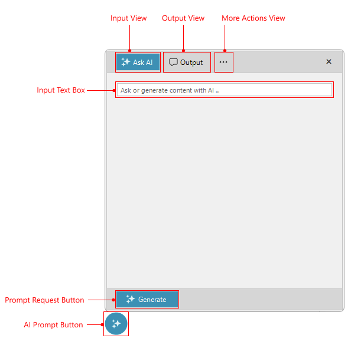

# Structure

This article will show the internal elements structure of __RadAIPrompt__.

>caption Figure 1: RadAIPrompt's Input View structure

>caption Figure 1: RadAIPrompt's Output View structure

* __Input view__: This navigates to the input view of RadAIPrompt. This view displays an input textbox and the custom suggestions.
* __Output view__: This navigates to the output view of RadAIPrompt. This view displays the generated response, which can be interacted with.
* __More Actions view__: This navigates to the actions view items of RadAIPrompt.
* __Prompt request button__: This button prompts the RadAIPrompt to request a response.
* __Title Text__: Title text of the AI response.
* __Input Text__: Input text of the user.
* __Response Text__: The text of the AI response.
* __Copy button__: This button copies the response.
* __Retry button__: This button requests another response from your AI model using the same input text.
* __Rating buttons__: These buttons rate the response returned from your AI model.
