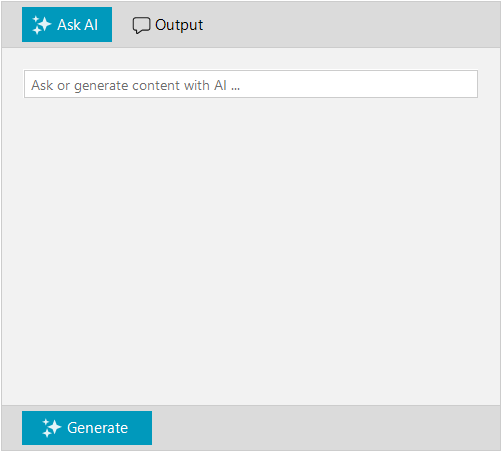
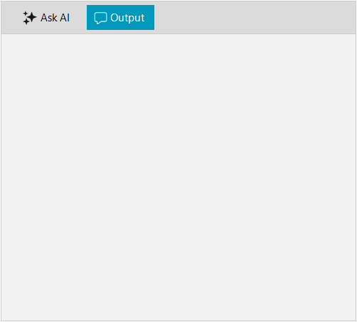
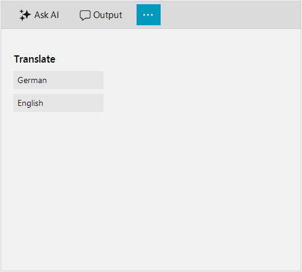

# Views

The RadAIPrompt control provides 3 default items that have as their content the default views. They will need to be included in its Items collection. The control supports only one instance of each view to be defined in this collection.

## Input view

The input view is represented by the __AIPromptInputView__. This view contains an input textbox that the user can type their request in. It also may display the custom suggestions that the user can add in the RadAIPrompt control.

>caption Figure 1: Input view

## Output view

The output view is represented by the __AIPromptOutputView__. This view displays the responses from your AI service. Each response is represented by an __AIPromptOutputItem__ and represent the responses from the AI. AIPromptOutputItems are added to __OutputItems__ collection. 

>caption Figure 2: Output view

The __AIPromptOutputItem__ provides the following properties:

* __Title__: Gets or sets the title of the AIPromptOutputItem.
* __InputText__: Gets or sets the input text that end-user has requested and it is displayed by the AIPromptOutputItem.
* __ResponseText__: Gets or sets the response text provided by your AI model that the AIPromptOutputItem will display.
* __Rating__: Gets or sets the rating of the end-user for the response returned by your AI model.
* __Tag__: Gets or sets an object associated with this AIPromptOutputItem.

>note When an output from the AI is generated, the Output view shows Copy, Retry, and Rating buttons. Please check the [Structure]() article.

## More Actions view

The More Actions View is an additional view in the toolbar that will display further actions defined by the user. This view is represented by a __AIPromptMoreActionsView__. It uses __RadAIPromptMoreActionsItem__ which can be added to __RadAIPrompt.Items__ collection. __RadAIPromptMoreActionsItem__ offers:
* __ItemText__: Gets or sets the text of the item in the toolbar.
* __ItemSvgImage__: Gets or sets the SVG image of the item in the toolbar.
* __ItemImage__: Gets or sets the image of the item in the toolbar.

The following code snippet demonstrates how to add __RadAIPromptMoreActionsItem__ to __AIPromptMoreActionsView__:

>caption Figure 3: More Actions view

<snippet id='aiprompt-views-moreactionsview-cs' />
<snippet id='aiprompt-views-moreactionsview-vb' />

## See Also

* [AIPrompt Button]()
* [Getting Started]()
