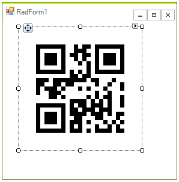
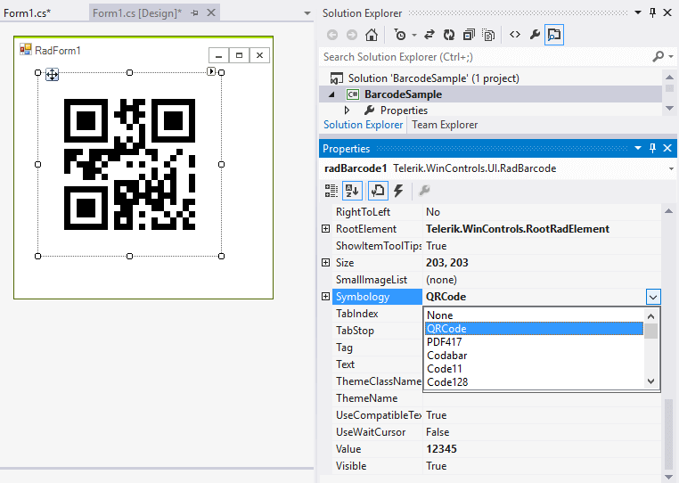
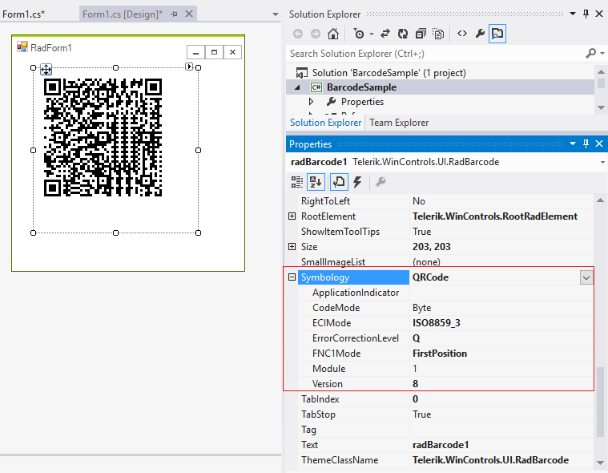
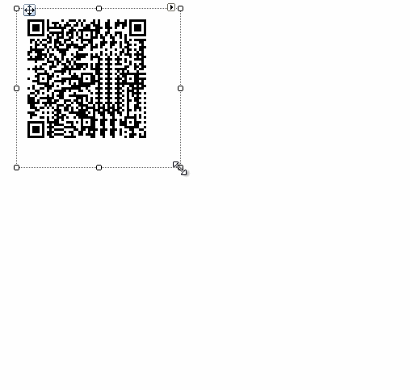

# Getting Started

1. To start using **RadBarcode** just drag it from the toolbox and drop it at the form.

	

	The default **Symbology** is *QRCode* and the initial value is *12345*.

	

1. After choosing the desired **Symbology** you can further adjust its specific settings if available:

	

1. The value which is encoded is set through the **Value** property.

1. The width (size) of the bar-code elements is auto calculated from the size of the control.

	

1. By default, **RadBarcode** uses black color to draw the bar-code elements. You can customize it by the **ForeColor** property.
 
        
