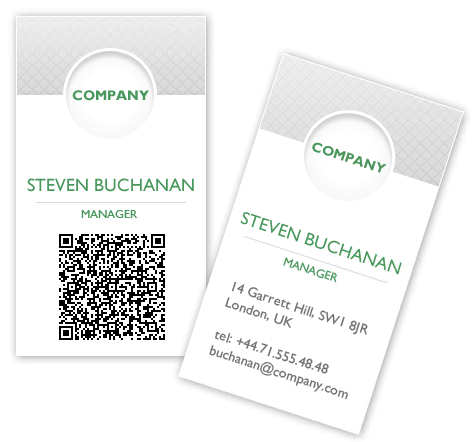

# Barcode

**RadBarcode** can be used to create and show barcodes. You can generate and visualize barcodes in a machine-readable format via the **RadBarcode** control by providing numeric or character data. 

>note As of R2 2022 Telerik UI for WinForms suite offers a new improved [RadBarcodeView]() control. You can check out the old documentation for the RadBarcode control which is obsolete.





# See Also

* [Design Time]()
* [Getting Started]()
 
        
