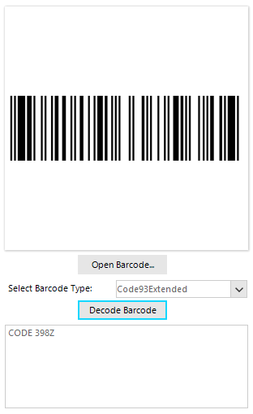

# RadBarcodeReader

**RadBarcodeReader** is the newest addition to the Barcode suite. The aim of the control is to decode image representations of one of the supported barcode symbologies.

Currently, all of the 1D barcodes, offered by Telerik, are supported. The list is available [here]().

When decoding a barcode image, the control will either display the type and text encoded in the image, or a warning specifying that no known symbology has been detected. A typical layout for the barcode reader is shown below:

>caption Demo application >> BarcodeReader example




The `Open Barcode` button lets the user choose an image path, to the image which will be decoded. The Decode Barcode triggers the decoding algorithm. The underlying text area is updated with the result of the decoding process.

The complete example is available in the Demo application >> BarcodeReader example.

#### Decoding a barcode image

{{source=..\SamplesCS\BarcodeView\BarcodeViewGettingStarted.cs region=Decoder}} 
{{source=..\SamplesVB\BarcodeView\BarcodeViewGettingStarted.vb region=Decoder}} 

````C#

BarcodeType barcodeType = Telerik.WinControls.UI.Barcode.Reader.BarcodeType.Code93Extended;
Bitmap bitmap = new Bitmap(Properties.Resources.barcode_reader);
RadBarcodeReader reader = new Telerik.WinControls.UI.Barcode.RadBarcodeReader();
var decodeResult = reader.Decode(bitmap, barcodeType);
if (decodeResult != null && decodeResult != DecodeResult.Empty)
{
    RadMessageBox.Show(decodeResult.Value);
} 
         
````
````VB.NET

Dim barcodeType As BarcodeType = Telerik.WinControls.UI.Barcode.Reader.BarcodeType.Code93Extended
Dim bitmap As Bitmap = New Bitmap(My.Resources.barcode_reader)
Dim reader As RadBarcodeReader = New Telerik.WinControls.UI.Barcode.RadBarcodeReader()
Dim decodeResult = reader.Decode(bitmap, barcodeType)

If decodeResult IsNot Nothing AndAlso Not decodeResult.Equals(DecodeResult.Empty) Then
    RadMessageBox.Show(decodeResult.Value)
End If

````

{{endregion}} 

>caution When decoding a barcode image, the image should contain only the barcode itself, no additional text to be present in that image. 

## Decoded Types

In some scenarios, to improve performance, you may want to specify the types of barcodes the reader will try to decode rather than have it iterate over all the available types.

This can also be useful to avoid conflicts between symbologies whose symbols may overlap, for example, **Code93** and **Code93Extended**.

For the purpose, you can use the **BarcodeType** argument of the **RadBarcodeReader**'s **Decode** and **DecodeAll** methods. It is a flags enumeration which holds the following types:

* **None**
* **Code128**
* **Code93**
* **Code93Extended**
* **CodeMSI**
* **EAN13**
* **EAN128**
* **EAN8**
* **Postnet**
* **Planet**
* **IntelligentMail**
* **UPCA**
* **UPCE**
* **UPCSupplement2**
* **UPCSupplement5**

In addition, the following values can also be set:

* **OneDimensional**: All 1D barcodes.
* **WidthModulated1D**: All width-modulated 1D barcodes (93 Extended included).
* **HeightModulated1D**: All height-modulated 1D barcodes.

# See Also

* [Design Time]()
* [Getting Started]()
 
        
