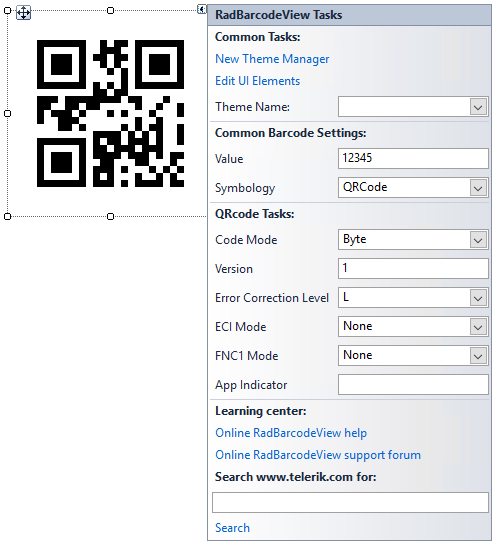

# Settings

This article explains the specific QR code settings.



## Mode

There are four values available for this property - *Alphanumeric*, *Numeric*, *Byte* and *Kanji*. Essentially, this determines the sets of acceptable symbols - numbers, characters, etc.

## Version

This is an integer value, in the range from 1 to 40, representing the desired barcode version. Usually, higher versions are used do accommodate larger amounts of data. If this property is not set, the encoder internally calculates the lowest possible version and uses it instead.

## Error Correction Level

There are four possible values to choose from - L(Low), M(Medium), Q(Quartile), H(High). These values allow for 7%, 15%, 25% and 30% recovery of symbol code words. Additionally, choosing a higher version of error correction dedicates a larger portion of modules for error correction. Thus, given two QR codes with the same sizes, the one with a lower error correction level would be able to accommodate more data.

## Extended Channel Interpretation (ECI)

The Extended Channel Interpretation, in short (ECI) allows for encoding of characters of different character sets. For example, choosing an ECI equal to 8859-7 will allow for encoding characters from the Latin/Greek alphabet. Please note, that the ECI setting is only respected when the Mode property of the control is set to *Byte*.

## FNC1

This mode is used for messages containing data formatted either in accordance with the UCC/EAN Application Identifiers standard or in accordance with a specific industry standard previously agreed with AIM International.

## Application Indicator

This setting allows for additional data to be applied to the FNC1 data. Please, keep in mind, that this is only applicable with FNC1Mode.*SecondPosition*. Additionally, the acceptable data for this property is in the range {a-z}],{[A-Z} and {00-99}.

Essentially, both the FNC1 property and the ApplicationIndicator data is applied to the raw data encoded in the control, allowing for special formatting.

#### Example

{{source=..\SamplesCS\BarcodeView\BarcodeViewGettingStarted.cs region=QRCode}} 
{{source=..\SamplesVB\BarcodeView\BarcodeViewGettingStarted.vb region=QRCode}}

````C#

QRCode encoder = new QRCode();
encoder.Version = 0;
encoder.ErrorCorrectionLevel = Telerik.WinControls.UI.Barcode.ErrorCorrectionLevel.M;
encoder.ECIMode = Telerik.WinControls.UI.Barcode.ECIMode.CP437;
encoder.CodeMode = Telerik.WinControls.UI.Barcode.CodeMode.Alphanumeric;
encoder.FNC1Mode = Telerik.WinControls.UI.Barcode.FNC1Mode.SecondPosition;
encoder.ApplicationIndicator = "00";
this.radBarcodeView1.Symbology = encoder;         

````
````VB.NET

Dim encoder As QRCode = New QRCode()
encoder.Version = 0
encoder.ErrorCorrectionLevel = Telerik.WinControls.UI.Barcode.ErrorCorrectionLevel.M
encoder.ECIMode = Telerik.WinControls.UI.Barcode.ECIMode.CP437
encoder.CodeMode = Telerik.WinControls.UI.Barcode.CodeMode.Alphanumeric
encoder.FNC1Mode = Telerik.WinControls.UI.Barcode.FNC1Mode.SecondPosition
encoder.ApplicationIndicator = "00"
Me.radBarcodeView1.Symbology = encoder

```` 
{{endregion}}


 
