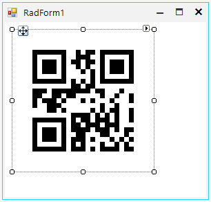
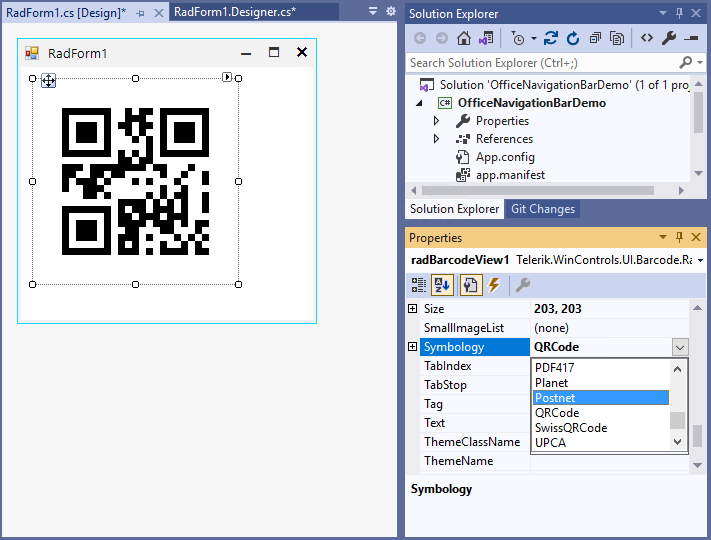
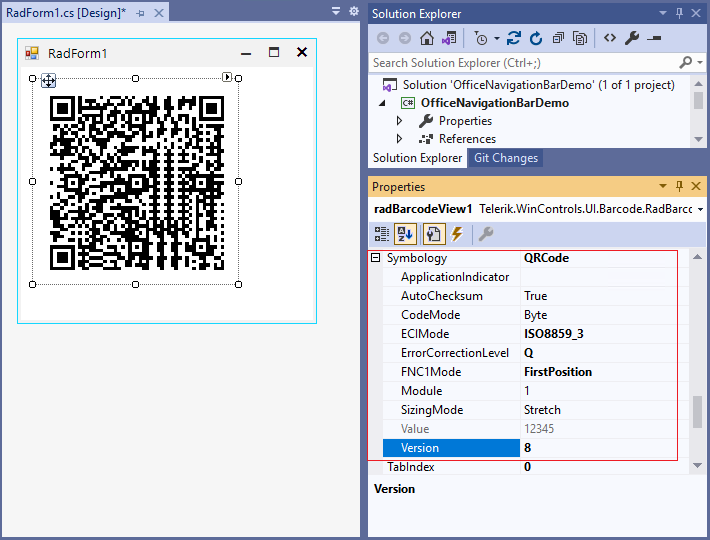

# Getting Started with WinForms BarcodeView

This article shows how you can start using RadBarcodeView.

## Adding Telerik Assemblies Using NuGet

To use `RadBarcodeView` when working with NuGet packages, install the `Telerik.UI.for.WinForms.AllControls` package. The [package target framework version may vary]().

Read more about NuGet installation in the [Install using NuGet Packages]() article.

>tip With the 2025 Q1 release, the Telerik UI for WinForms has a new licensing mechanism. You can learn more about it [here]().

## Adding Assembly References Manually

When dragging and dropping a control from the Visual Studio (VS) Toolbox onto the Form Designer, VS automatically adds the necessary assemblies. However, if you're adding the control programmatically, you'll need to manually reference the following assemblies:

* __Telerik.Licensing.Runtime__
* __Telerik.WinControls__
* __Telerik.WinControls.UI__
* __TelerikCommon__

The Telerik UI for WinForms assemblies can be install by using one of the available [installation approaches](). 

## Defining the RadBarcodeView

1. To start using **RadBarcodeView** just drag it from the toolbox and drop it at the form.

	

	The default **Symbology** is *QRCode* and the initial value is *12345*.

	

1. After choosing the desired **Symbology** you can further adjust its specific settings if available:

	

1. The value which is encoded is set through the **Value** property.

1. The width (size) of the bar-code elements is auto calculated from the size of the control.

	

1. By default, **RadBarcodeView** uses black color to draw the bar-code elements. You can customize it by the **ForeColor** property.
 
        

## Telerik UI for WinForms Learning Resources
* [Telerik UI for WinForms BarcodeView Component](https://www.telerik.com/products/winforms/barcode.aspx)
* [Getting Started with Telerik UI for WinForms Components](https://docs.telerik.com/devtools/winforms/getting-started/first-steps)
* [Telerik UI for WinForms Setup](https://docs.telerik.com/devtools/winforms/installation-and-upgrades/installing-on-your-computer)
* [Telerik UI for WinForms Application Modernization](https://docs.telerik.com/devtools/winforms/winforms-converter/overview)
* [Telerik UI for WinForms Visual Studio Templates](https://docs.telerik.com/devtools/winforms/visual-studio-integration/visual-studio-templates)
* [Deploy Telerik UI for WinForms Applications](https://docs.telerik.com/devtools/winforms/deployment-and-distribution/application-deployment)
* [Telerik UI for WinForms Virtual Classroom(Training Courses for Registered Users)](https://learn.telerik.com/learn/course/external/view/elearning/17/telerik-ui-for-winforms)
* [Telerik UI for WinForms License Agreement)](https://www.telerik.com/purchase/license-agreement/winforms-dlw-s)

