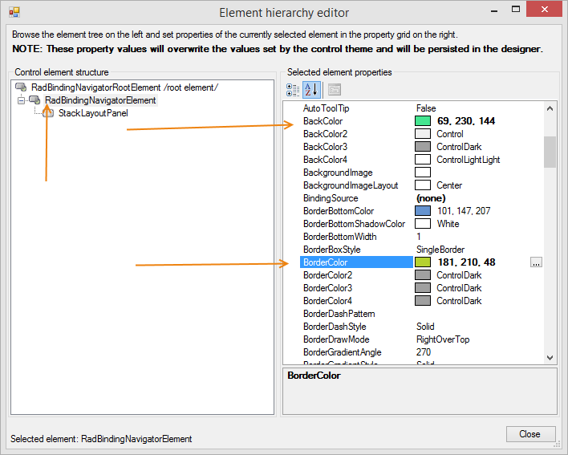
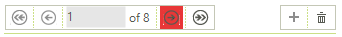
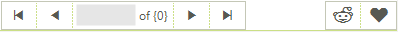

# Customizing RadBindingNavigator 

Each of the control's elements can be accessed and customized. Once you access the desired elements, you can tweak their properties in order to modify them. 

### Customize Fill and Border

You can access the control element by opening the [Element Hierarchy Editor]() from the controls smart tag. This allows you to select elements and change their properties. The next image shows how you can change the BackColor and the BorderColor.

>caption Figure 1: Change the BackColor and the BorderColor.

### Customize Buttons

The following snippet shows how you can access and change the properties of navigator buttons.

<snippet id='bindingnavigator-customizing-radbindingnavigator-changebuttoncolor-cs'/>
<snippet id='bindingnavigator-customizing-radbindingnavigator-changebuttoncolor-vb'/>

 

>caption The NextButton background is changed:

### Using glyphs

As of R2 2021 **RadBindingNavigator** can be customized to [use glyphs](https://docs.telerik.com/devtools/winforms/telerik-presentation-framework/glyphs) for the buttons instead of images. The **ButtonDisplayStyle** property defines whether the buttons will display image or glyphs. You can also specify the **ButtonGlyphSize** which determines the font size of the glyphs displayed in the buttons.

The following example shows how you can apply glyphs for the buttons:

<snippet id='bindingnavigator-customizing-radbindingnavigator-buttonglyph-cs'/>
<snippet id='bindingnavigator-customizing-radbindingnavigator-buttonglyph-vb'/>

 

>caption The AddNewButton and DeleteButton are customized with custom glyphs:

## See Also

 * [Properties]()
 * [Structure]()
