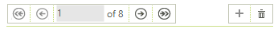

# Getting Started with WinForms BindingNavigator

The following tutorial will demonstrate how to get __RadBindingNavigator__ up and running: 

## Adding Telerik Assemblies Using NuGet

To use `RadBindingNavigator` when working with NuGet packages, install the `Telerik.UI.for.WinForms.AllControls` package. The [package target framework version may vary]().

Read more about NuGet installation in the [Install using NuGet Packages]() article.

>tip With the 2025 Q1 release, the Telerik UI for WinForms has a new licensing mechanism. You can learn more about it [here]().

## Adding Assembly References Manually

When dragging and dropping a control from the Visual Studio (VS) Toolbox onto the Form Designer, VS automatically adds the necessary assemblies. However, if you're adding the control programmatically, you'll need to manually reference the following assemblies:

* __Telerik.Licensing.Runtime__
* __Telerik.WinControls__
* __Telerik.WinControls.UI__
* __TelerikCommon__

The Telerik UI for WinForms assemblies can be install by using one of the available [installation approaches](). 

## Defining the RadBindingNaviagator

1\.Place __RadBindingNaviagator__ control and BindingSource component on a form.

2\. Setup the `DataSource` property of the `BindingSource` and the `BindingSource` property of __RadBindingNaviagator__.
          
<snippet id='bindingnavigator-getting-started-radbindingnavigator1-cs'/>
<snippet id='bindingnavigator-getting-started-radbindingnavigator1-vb'/>

 

3\. Press __F5__ to run the project and you should see the following:

>caution Due to the nature of the way __RadBindingNavigator__ is created at design time its __Name__ property should not be changed (does not apply if the control is created at runtime).
>(This is needed in order to map the handler of a certain button with the button itself and have it accessible and editable at design time, as is it not possible to generate click event handler with the code in it at design time).
>

## See Also

 * [Using Custom Themes]()
 * [Loading Custom Themes]()
 * [Customizing Appearance]()

## Telerik UI for WinForms Learning Resources
* [Telerik UI for WinForms BindingNavigator Component](https://www.telerik.com/products/winforms/bindingnavigator.aspx)
* [Getting Started with Telerik UI for WinForms Components](https://docs.telerik.com/devtools/winforms/getting-started/first-steps)
* [Telerik UI for WinForms Setup](https://docs.telerik.com/devtools/winforms/installation-and-upgrades/installing-on-your-computer)
* [Telerik UI for WinForms Converter](https://www.telerik.com/products/winforms/documentation/ai-coding-assistant/converter/converter)
* [Telerik UI for WinForms Visual Studio Templates](https://docs.telerik.com/devtools/winforms/visual-studio-integration/visual-studio-templates)
* [Deploy Telerik UI for WinForms Applications](https://docs.telerik.com/devtools/winforms/deployment-and-distribution/application-deployment)
* [Telerik UI for WinForms Virtual Classroom(Training Courses for Registered Users)](https://learn.telerik.com/learn/course/external/view/elearning/17/telerik-ui-for-winforms)
* [Telerik UI for WinForms License Agreement)](https://www.telerik.com/purchase/license-agreement/winforms-dlw-s)

