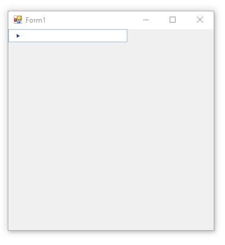

**RadBreadCumb** internally uses an invisible **RadTreeView** to manage the hierarchical structure if there is not associated tree view via the RadBreadCrumb.**DefaultTreeView** property. You can access it via the **InternalTreeViewElement** property of the **RadBreadCrumbElement**. 

>note When the RadBreadCrumbElement.**DefaultTreeViewElement** property is set (which means that you have an associated tree view), the **InternalTreeViewElement** will be ignored.

## Define Relations in RadBreadCrumb

Since **RadBreadCrumb** internally uses a **RadTreeView**, you can use the [data binding]() options that **RadTreeView** offers. The following code snippet demonstrates how to define relations between 3 different data collections and build 3-level hierarchy:

>caption RadBreadCrumb bound to the MusicCollection database




````C#

this.radBreadCrumb1.IsAutoCompleteEnabled = true;
this.radBreadCrumb1.DataSource = this.artistsBindingSource;
this.radBreadCrumb1.DisplayMember = "ArtistName";
this.radBreadCrumb1.ValueMember = "ArtistID";
this.radBreadCrumb1.RelationBindings.Add(new RelationBinding(this.albumsBindingSource, "AlbumName", "ArtistID", "ArtistID", "AlbumID"));
this.radBreadCrumb1.RelationBindings.Add(new RelationBinding(this.songsBindingSource, "SongName", "AlbumID", "AlbumID", "SongID"));
        

````
````VB.NET

    Me.radBreadCrumb1.IsAutoCompleteEnabled = True
    Me.radBreadCrumb1.DataSource = Me.artistsBindingSource
    Me.radBreadCrumb1.DisplayMember = "ArtistName"
    Me.radBreadCrumb1.ValueMember = "ArtistID"
    Me.radBreadCrumb1.RelationBindings.Add(New RelationBinding(Me.albumsBindingSource, "AlbumName", "ArtistID", "ArtistID", "AlbumID"))
    Me.radBreadCrumb1.RelationBindings.Add(New RelationBinding(Me.songsBindingSource, "SongName", "AlbumID", "AlbumID", "SongID"))

```` 

## See Also
* [Getting Started]()  

