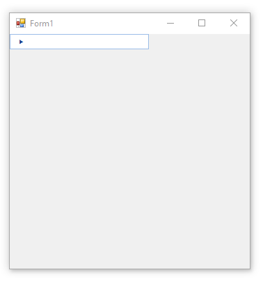

# Data Binding

**RadBreadCumb** internally uses an invisible **RadTreeView** to manage the hierarchical structure if there is not associated tree view via the RadBreadCrumb.**DefaultTreeView** property. You can access it via the **InternalTreeViewElement** property of the **RadBreadCrumbElement**. 

>note When the RadBreadCrumbElement.**DefaultTreeViewElement** property is set (which means that you have an associated tree view), the **InternalTreeViewElement** will be ignored.

## Define Relations in RadBreadCrumb

Since **RadBreadCrumb** internally uses a **RadTreeView**, you can use the [data binding]() options that **RadTreeView** offers. The following code snippet demonstrates how to define relations between 3 different data collections and build 3-level hierarchy:

>caption RadBreadCrumb bound to the MusicCollection database

<snippet id='breadcrumb-breadcrumb-relationbindings-cs' />
<snippet id='breadcrumb-breadcrumb-relationbindings-vb' />

## See Also
* [Getting Started]()  

