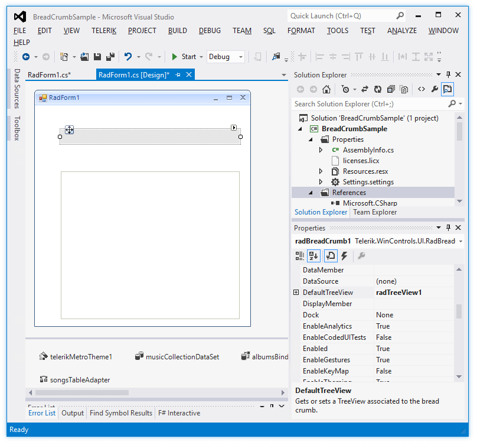
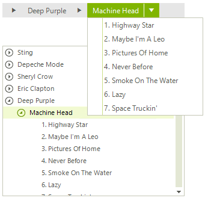

# Getting Started

This tutorial will walk you through the creation of **RadBreadCrumb** in your project and associating it with **RadTreeView**. Follow the steps:

1. Add a **RadBreadCrumb** and a **RadTreeView** to the form.
2. [Data bind]() the **RadTreeView** control.
3. Set the RadBreadCrumb.**DefaultTreeView** property to the tree view control on the form.

	 

When you run the project and select a node in **RadTreeView**, the **RadBreadCrumb** control will be populated with the path to the selected node:
 
>caption RadBreadCrumb associated with a RadTreeView

 

## Using RadBreadCrumb as a standalone control 

Similar to **RadTreeView**, **RadBreadCrumb** can also be bound to a collection of records. It is just necessary to set its **DataSource**, **DisplayMember**, **ChildMember** and **ParentMember** properties. In addition, enable the **IsAutoCompleteEnabled** property in order to get suggestions when the user types in the text box:

````C#

        public RadForm1()
        {
            InitializeComponent();

            this.radBreadCrumb1.DisplayMember = "name";
            this.radBreadCrumb1.ParentMember = "pid";
            this.radBreadCrumb1.ChildMember = "id";
            this.radBreadCrumb1.DataSource = this.GetSampleData();

            this.radBreadCrumb1.IsAutoCompleteEnabled = true;
        }

        private DataTable GetSampleData()
        {
            DataTable dt = new DataTable();

            DataColumn dc = new DataColumn();
            dc.ColumnName = "id";
            dc.DataType = typeof(int);
            dt.Columns.Add(dc);

            DataColumn dc1 = new DataColumn();
            dc1.ColumnName = "name";
            dc1.DataType = typeof(string);
            dt.Columns.Add(dc1);

            DataColumn dc2 = new DataColumn();
            dc2.ColumnName = "pid";
            dc2.DataType = typeof(int);
            dt.Columns.Add(dc2);

            DataRow dr = dt.NewRow();
            dr[0] = 0;
            dr[1] = "My Computer";
            dr[2] = DBNull.Value;
            dt.Rows.Add(dr);

            dr = dt.NewRow();
            dr[0] = 1;
            dr[1] = @"C:";
            dr[2] = 0;
            dt.Rows.Add(dr);

            dr = dt.NewRow();
            dr[0] = 2;
            dr[1] = @"D:";
            dr[2] = 0;
            dt.Rows.Add(dr);

            dr = dt.NewRow();
            dr[0] = 3;
            dr[1] = "Program Files";
            dr[2] = 1;
            dt.Rows.Add(dr);

            dr = dt.NewRow();
            dr[0] = 4;
            dr[1] = "Microsoft";
            dr[2] = 3;
            dt.Rows.Add(dr);

            dr = dt.NewRow();
            dr[0] = 5;
            dr[1] = "Telerik";
            dr[2] = 3;
            dt.Rows.Add(dr);

            dr = dt.NewRow();
            dr[0] = 6;
            dr[1] = "WINDOWS";
            dr[2] = 1;
            dt.Rows.Add(dr);

            return dt;
        }           

````
````VB.NET
    Public Sub New()
        InitializeComponent()
        Me.radBreadCrumb1.DisplayMember = "name"
        Me.radBreadCrumb1.ParentMember = "pid"
        Me.radBreadCrumb1.ChildMember = "id"
        Me.radBreadCrumb1.DataSource = Me.GetSampleData()
        Me.radBreadCrumb1.IsAutoCompleteEnabled = True
    End Sub

    Private Function GetSampleData() As DataTable
        Dim dt As DataTable = New DataTable()
        Dim dc As DataColumn = New DataColumn()
        dc.ColumnName = "id"
        dc.DataType = GetType(Integer)
        dt.Columns.Add(dc)
        Dim dc1 As DataColumn = New DataColumn()
        dc1.ColumnName = "name"
        dc1.DataType = GetType(String)
        dt.Columns.Add(dc1)
        Dim dc2 As DataColumn = New DataColumn()
        dc2.ColumnName = "pid"
        dc2.DataType = GetType(Integer)
        dt.Columns.Add(dc2)
        Dim dr As DataRow = dt.NewRow()
        dr(0) = 0
        dr(1) = "My Computer"
        dr(2) = DBNull.Value
        dt.Rows.Add(dr)
        dr = dt.NewRow()
        dr(0) = 1
        dr(1) = "C:"
        dr(2) = 0
        dt.Rows.Add(dr)
        dr = dt.NewRow()
        dr(0) = 2
        dr(1) = "D:"
        dr(2) = 0
        dt.Rows.Add(dr)
        dr = dt.NewRow()
        dr(0) = 3
        dr(1) = "Program Files"
        dr(2) = 1
        dt.Rows.Add(dr)
        dr = dt.NewRow()
        dr(0) = 4
        dr(1) = "Microsoft"
        dr(2) = 3
        dt.Rows.Add(dr)
        dr = dt.NewRow()
        dr(0) = 5
        dr(1) = "Telerik"
        dr(2) = 3
        dt.Rows.Add(dr)
        dr = dt.NewRow()
        dr(0) = 6
        dr(1) = "WINDOWS"
        dr(2) = 1
        dt.Rows.Add(dr)
        Return dt
    End Function

````

>caption RadBreadCrumb used as a standalone control

 

>important Please avoid using the character set as a PathSeparator in the Header of the items, because this can lead to an unexpected behavior when you try to expand a path. Also, keep in mind that the '**&#92;**' character is the default **PathSeparator**.

## See Also
* [Structure]()  

