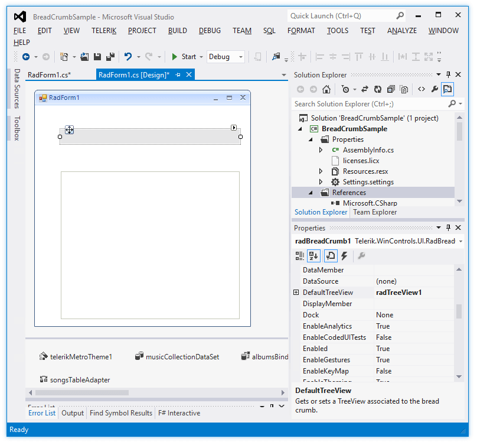
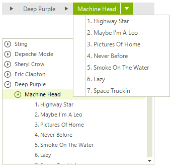
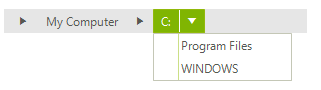

# Getting Started with WinForms BreadCrumb

This tutorial will walk you through the creation of **RadBreadCrumb** in your project and associating it with **RadTreeView**. Follow the steps:

## Adding Telerik Assemblies Using NuGet

To use `RadBreadCrumb` when working with NuGet packages, install the `Telerik.UI.for.WinForms.AllControls` package. The [package target framework version may vary]().

Read more about NuGet installation in the [Install using NuGet Packages]() article.

>tip With the 2025 Q1 release, the Telerik UI for WinForms has a new licensing mechanism. You can learn more about it [here]().

## Adding Assembly References Manually

When dragging and dropping a control from the Visual Studio (VS) Toolbox onto the Form Designer, VS automatically adds the necessary assemblies. However, if you're adding the control programmatically, you'll need to manually reference the following assemblies:

* __Telerik.Licensing.Runtime__
* __Telerik.WinControls__
* __Telerik.WinControls.UI__
* __TelerikCommon__

The Telerik UI for WinForms assemblies can be install by using one of the available [installation approaches](). 

## Defining the RadBreadCrumb

1. Add a **RadBreadCrumb** and a **RadTreeView** to the form.
2. [Data bind]() the **RadTreeView** control.
3. Set the RadBreadCrumb.**DefaultTreeView** property to the tree view control on the form.

	 

When you run the project and select a node in **RadTreeView**, the **RadBreadCrumb** control will be populated with the path to the selected node:
 
>caption RadBreadCrumb associated with a RadTreeView

 

## Using RadBreadCrumb as a standalone control 

Similar to **RadTreeView**, **RadBreadCrumb** can also be bound to a collection of records. It is just necessary to set its **DataSource**, **DisplayMember**, **ChildMember** and **ParentMember** properties. In addition, enable the **IsAutoCompleteEnabled** property in order to get suggestions when the user types in the text box:

<snippet id='breadcrumb-breadcrumb-standalonedatabinding-cs' />
<snippet id='breadcrumb-breadcrumb-standalonedatabinding-vb' />

>caption RadBreadCrumb used as a standalone control

 

>important Please avoid using the character set as a PathSeparator in the Header of the items, because this can lead to an unexpected behavior when you try to expand a path. Also, keep in mind that the '**&#92;**' character is the default **PathSeparator**.

## See Also
* [Structure]()  

## Telerik UI for WinForms Learning Resources
* [Telerik UI for WinForms BreadCrumb Component](https://www.telerik.com/products/winforms/breadcrumb.aspx)
* [Getting Started with Telerik UI for WinForms Components](https://docs.telerik.com/devtools/winforms/getting-started/first-steps)
* [Telerik UI for WinForms Setup](https://docs.telerik.com/devtools/winforms/installation-and-upgrades/installing-on-your-computer)
* [Telerik UI for WinForms Converter](https://www.telerik.com/products/winforms/documentation/ai-coding-assistant/converter/converter)
* [Telerik UI for WinForms Visual Studio Templates](https://docs.telerik.com/devtools/winforms/visual-studio-integration/visual-studio-templates)
* [Deploy Telerik UI for WinForms Applications](https://docs.telerik.com/devtools/winforms/deployment-and-distribution/application-deployment)
* [Telerik UI for WinForms Virtual Classroom(Training Courses for Registered Users)](https://learn.telerik.com/learn/course/external/view/elearning/17/telerik-ui-for-winforms)
* [Telerik UI for WinForms License Agreement)](https://www.telerik.com/purchase/license-agreement/winforms-dlw-s)

