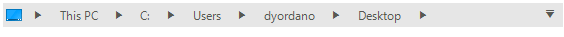

# WinForms BreadCrumb Overview

As of **R3 2019** Telerik UI for WinForms suite offers an improved **RadBreadCrumb** control. It offers you to build complicated navigation systems that allow you to track the navigation history. With its powerful data-binding mechanism, the control lets you display hierarchical structures, such as directories and relational data. With its auto-complete functionality and other advanced capabilities, **RadBreadCrumb** significantly improves the navigation and performance of your application.





## Key Features

* **Text editing and Parse mechanism** – this will allow the users to manually type/edit/paste the path to the desired node and when edit mode ends the parse logic will convert the input text to a valid selected node. 

	>important The default **PathSeparator** is '**&#92;**'.

* **AutoComplete** – this will allow auto completion when the user types.

* **History** – holds information about the recently selected locations/places/nodes. Users can navigate to each of them using the history drop down button. 

* **AutoSize**: supports automatic height according to the design in each theme. It also allows the users to specify their own height for the control and its contents will be stretched vertically.   

* **Custom buttons/elements support** - two predefined element collections on the left and right will allow the users option to add buttons(or other elements) on the left and on the right side. 

* **DataSource** – allows the control to be used separately without pairing to a **RadTreeView**. When the **DataSource** is set it creates an internal tree structure composed of **RadTreeNodes**. 

* **Auto hide items** - when there is not enough space to fit all items horizontally, items are displayed in a pop up menu.

* **Custom items/favorites** – this will give the users an option to add custom/default items with associated path(**RadTreeNode**) allowing fast navigation to a set of predefined places. 

* **Multiple root nodes** - this allows users to choose between the different root nodes in the tree view. 

## Telerik UI for WinForms Learning Resources
* [Telerik UI for WinForms BreadCrumb Homepage](https://www.telerik.com/products/winforms/breadcrumb.aspx)
* [Get Started with the Telerik UI for WinForms BreadCrumb]()
* [Telerik UI for WinForms API Reference](https://docs.telerik.com/devtools/winforms/api/)
* [Getting Started with Telerik UI for WinForms Components]()
* [Telerik UI for WinForms Virtual Classroom (Training Courses for Registered Users)](https://learn.telerik.com/learn/course/external/view/elearning/17/TelerikUIforWinForms) 
* [Telerik UI for WinForms Forum](https://www.telerik.com/forums/winforms)
* [Telerik UI for WinForms Knowledge Base](https://docs.telerik.com/devtools/winforms/knowledge-base)

## See Also
* [Structure]() 

