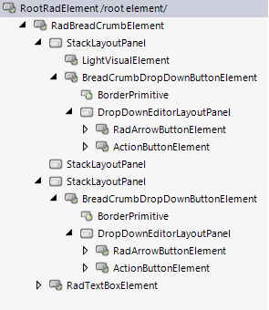

# Structure

This article will show the internal elements structure of **RadBreadCrumb**.

>caption Figure 1: RadBreadCrumb's elements hierarchy

>caption Figure 2: RadBreadCrumb's structure

**RadBreadCrumb** has one main element: **RadBreadCrumbElement**. It hosts three element containers and a text box: 

* **LeftElementsStack** - **StackLayoutPanel** that hosts the image element and the Header drop down button.

* **MainStack** - **StackLayoutPanel** hosts a collection of **RadSplitButtonElements** that represent the path to the selected **RadTreeNode**.  

* **RightElementsStack** - **StackLayoutPanel** that hosts the history button. 

* **TextBoxElement** - **RadTextBoxElement** that will be used in edit mode. 
 
## See Also
* [Structure]() 
* [Getting Started]()

