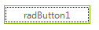

# Indicating Focus

__RadButton__ can indicate that it is focused by showing a thin dotted rectangular frame. The dotted rectangular frame will be once shown when using __Tab__ navigation. This feature is enabled by default. You can disable it by setting __AllowShowFocusCues__ property to *false* (the default value is *true*). The style of the frame cannot be customized. 
 
 
          
