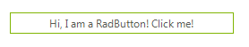

# WinForms Buttons Overview

__RadButton__ is a [themable] () replacement of the standard WinForms Button. It can be clicked by using the mouse, *Enter* key, or *Spacebar*, if the button has focus. You can also use [Smart Tags](), set [Properties](), [Customize its Appearance]() and assign [Tooltips]().





>caption Figure 1: RadButton

>tip In the related [Getting Started](https://docs.telerik.com/devtools/winforms/controls/buttons/button/getting-started) article you can find how to use the control with a sample scenario.

> Download and check out the online demo at [demos.telerik.com](https://telerik-winforms-demos.s3.amazonaws.com/TelerikWinFormsExamplesLauncher.exe)

## Telerik UI for WinForms Learning Resources
* [Telerik UI for WinForms Button Homepage](https://www.telerik.com/products/winforms/buttons.aspx)
* [Get Started with the Telerik UI for WinForms Button]()
* [Telerik UI for WinForms API Reference](https://docs.telerik.com/devtools/winforms/api/)
* [Getting Started with Telerik UI for WinForms Components]()
* [Telerik UI for WinForms Virtual Classroom (Training Courses for Registered Users)](https://learn.telerik.com/learn/course/external/view/elearning/17/TelerikUIforWinForms) 
* [Telerik UI for WinForms Forum](https://www.telerik.com/forums/winforms)
* [Telerik UI for WinForms Knowledge Base](https://docs.telerik.com/devtools/winforms/knowledge-base)

## Telerik UI for WinForms Additional Resources
* [Telerik UI for WinForms Product Overview](https://www.telerik.com/products/winforms.aspx)
* [Telerik UI for WinForms Blog](https://www.telerik.com/blogs/desktop-winforms)
* [Telerik UI for WinForms Videos](https://www.telerik.com/videos/product/winforms)
* [Telerik UI for WinForms Roadmap](https://www.telerik.com/support/whats-new/winforms/roadmap)
* [Telerik UI for WinForms Pricing](https://www.telerik.com/purchase/individual/winforms.aspx)
* [Telerik UI for WinForms Code Library](https://www.telerik.com/support/code-library/winforms)
* [Telerik UI for WinForms Support](https://www.telerik.com/support/winforms)
* [What’s New in Telerik UI for WinForms](https://www.telerik.com/support/whats-new/winforms)

## See Also

* [Getting Started]()
* [Structure]()
* [Design Time]()
* [Tooltips]()
* [Properties, Methods and Events]()

        
