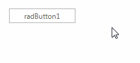

# Tooltips

There are two ways to assign tooltips to __RadButton__, namely setting the __ToolTipText__ property of the __ButtonElement__, or as in most of the RadControls by using the __ToolTipTextNeeded__ event of __RadButton__. It is necessary the __ShowItemToolTips__ property to be set to *true* which is the default value.

#### Setting the ToolTipText property

{{source=..\SamplesCS\Buttons\Button.cs region=SetToolTipText}} 
{{source=..\SamplesVB\Buttons\Button.vb region=SetToolTipText}}

````C#
this.radButton1.ButtonElement.ToolTipText = "I am a button";

````
````VB.NET
Me.radButton1.ButtonElement.ToolTipText = "I am a button"

````

{{endregion}} 



#### Setting tool tips in the ToolTipTextNeeded event

{{source=..\SamplesCS\Buttons\Button.cs region=ToolTipTextNeeded}} 
{{source=..\SamplesVB\Buttons\Button.vb region=ToolTipTextNeeded}}

````C#
private void radButton1_ToolTipTextNeeded(object sender, Telerik.WinControls.ToolTipTextNeededEventArgs e)
{
    e.ToolTipText = "Click me";
}

````
````VB.NET
Private Sub radButton1_ToolTipTextNeeded(sender As Object, e As Telerik.WinControls.ToolTipTextNeededEventArgs)
    e.ToolTipText = "Click me"
End Sub

````

{{endregion}} 


>note The __ToolTipTextNeeded__ event has higher priority and overrides the tool tips set in  the __ToolTipText__ property.

        

        
