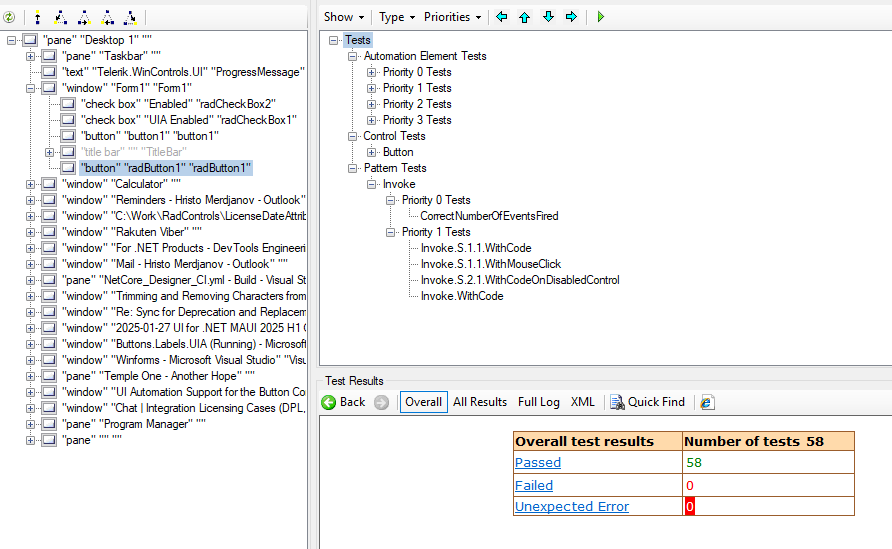

# UI Automation Support

With the __Q1 2025__ version of our controls, RadButton supports UI Automation. The current implementation of UI Automation for RadButton is similar to the MS WinForms Button Control implementation with some extended functionality. The main goal of this implementation is to ensure compliance with accessibility standards and to provide a common practice for automated testing. 

This functionality is enabled by default. To disable it, you can set the __EnableUIAutomation__ property to false.


````C#

this.radButton1.EnableUIAutomation = false;

````
````VB.NET

Me.RadButton1.EnableUIAutomation = False

````



## Relevant Properties 

The table below outlines the __UI Automation__ properties most important for understanding and interacting with RadButton control.

#### RadButton 

* AutomationElementIdentifiers.AutomationIdProperty.Id 
* AutomationElementIdentifiers.AcceleratorKeyProperty.Id
* AutomationElementIdentifiers.AccessKeyProperty.Id
* AutomationElementIdentifiers.BoundingRectangleProperty.Id
* AutomationElementIdentifiers.ControlTypeProperty.Id
* AutomationElementIdentifiers.LocalizedControlTypeProperty.Id => "button"
* AutomationElementIdentifiers.HelpTextProperty.Id
* AutomationElementIdentifiers.IsContentElementProperty.Id
* AutomationElementIdentifiers.IsEnabledProperty.Id
* AutomationElementIdentifiers.IsControlElementProperty.Id
* AutomationElementIdentifiers.IsKeyboardFocusableProperty.Id
* AutomationElementIdentifiers.NameProperty.Id 

## Supported Control Patterns

The following section outlines the supported automation patterns for the __RadButton__ control and its constituent elements.

* [Invoke Pattern](https://learn.microsoft.com/en-us/dotnet/api/system.windows.automation.provider.iinvokeprovider?view=windowsdesktop-9.0)

The RadButton control raises the following events

* __OnClick__: Raises the UIA [InvokePatternIdentifiers.InvokedEvent Field](https://learn.microsoft.com/en-us/dotnet/api/system.windows.automation.invokepatternidentifiers.invokedevent?view=windowsdesktop-9.0#system-windows-automation-invokepatternidentifiers-invokedevent)
* __OnGotFocus__: Raises the [UIA AutomationElementIdentifiers.AutomationFocusChangedEvent Field](https://learn.microsoft.com/en-us/dotnet/api/system.windows.automation.automationelementidentifiers.automationfocuschangedevent?view=windowsdesktop-9.0#system-windows-automation-automationelementidentifiers-automationfocuschangedevent)
* __OnEnabledChanged__: Raises the [UIA AutomationElementIdentifiers.IsEnabledProperty Field](https://learn.microsoft.com/en-us/dotnet/api/system.windows.automation.automationelementidentifiers.isenabledproperty?view=windowsdesktop-9.0#system-windows-automation-automationelementidentifiers-isenabledproperty)


