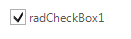

# CheckBox

__RadCheckBox__ is designed to provide an interface element that can represent an *On* or *Off* state using a check mark. To learn how to manage the states of __RadCheckBox__ see  [Handling Telerik RadCheckBox States](). In [DataBinding with the Telerik RadCheckBox]() you will learn how to leverage the __DataBinding__ features of __RadCheckBox__. In addition, __RadCheckBox__, like all of the other controls in Telerik UI for WinForms suite, has versatile design options.
__RadCheckBox__ supports three states. This is controlled by the __IsThreeState__ property. If it is set to *false*, the __ToggleState__ property, which determines the current state of the check mark, can be  __On__ or __Off__ . Otherwise, it can be set to __On__ , __Off__ , or __Indeterminate__ .





        
