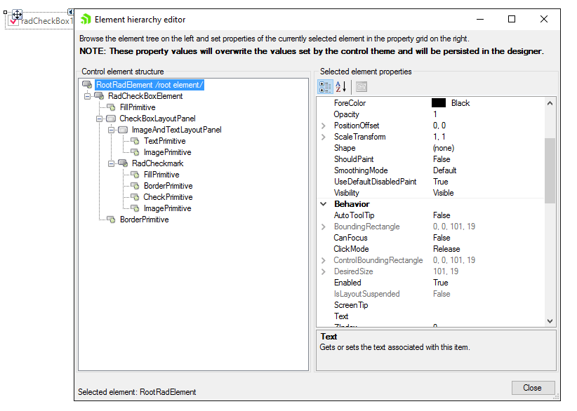
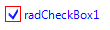

# Accessing and Customizing Elements
 
Accessing and customizing elements can be performed either at design time, or at run time. Before proceeding with this topic, it is recommended to get familiar with the [visual structure]() of the __RadCheckBox__.
      

## Design time

You can access and modify the style for different elements in __RadCheckBox__ by using the Element hierarchy editor. It can be accessed by selecting the *Edit UI Elements* item from the Smart Tag.

>caption Figure 1: Element hierarchy editor

## Programmatically

You can customize the nested elements at run time as well:

>caption Figure 2: Customize elements

#### Customize elements 

<snippet id='buttons-checkbox-accessing-and-customizing-elements-accessingcustomizingelements-cs' />
<snippet id='buttons-checkbox-accessing-and-customizing-elements-accessingcustomizingelements-vb' />

