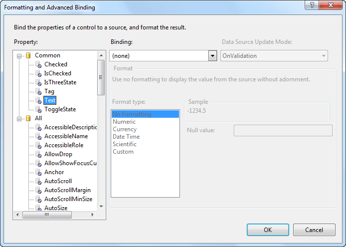

# DataBinding RadCheckBox

RadCheckBox supports all DataBinding features you might expect from a Windows Forms control.

## DataBinding at Design-time

To add __DataBindings__ at Design Time, expand the __(DataBindings)__ property, and then click the *ellipsis* button __(Advanced)__ to launch the __Formatting__ __and__ __Advanced Binding__ dialog.



Scroll down the property list and find the __IsChecked__ property. From the Binding drop-down menu, select the data source, and then the property that you wish to bind. Click __OK__. Now the __IsChecked__ property of your Telerik RadCheckBox is bound to your source.

## Programmatic DataBinding 

You can also add __DataBindings__ to your control programmatically. The following code demonstrates binding the __IsChecked__ property to a column in a __DataTable__. 
 

{{source=..\SamplesCS\Buttons\CheckBox.cs region=databinding}} 
{{source=..\SamplesVB\Buttons\CheckBox.vb region=databinding}} 

````C#
           
this.radCheckBox1.IsThreeState = false;
DataTable t = new DataTable();
t.Columns.Add("A", typeof(bool));
t.Rows.Add(true);
t.Rows.Add(false);
t.Rows.Add(true);
this.radCheckBox1.DataBindings.Add(new Binding("IsChecked", t, "A"));

````
````VB.NET
Me.radCheckBox1.IsThreeState = False
Dim t As New DataTable
t.Columns.Add("A", GetType(Boolean))
t.Rows.Add(True)
t.Rows.Add(False)
t.Rows.Add(True)
Me.radCheckBox1.DataBindings.Add(New Binding("IsChecked", t, "A"))

````

{{endregion}} 


