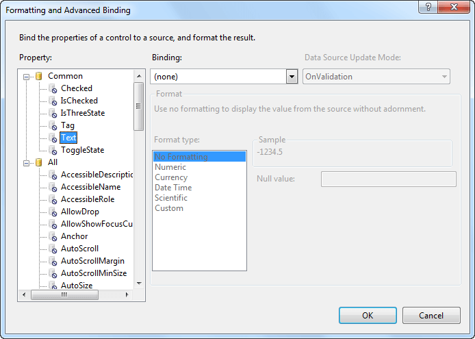

# DataBinding RadCheckBox

RadCheckBox supports all DataBinding features you might expect from a Windows Forms control.

## DataBinding at Design-time

To add __DataBindings__ at Design Time, expand the __(DataBindings)__ property, and then click the *ellipsis* button __(Advanced)__ to launch the __Formatting__ __and__ __Advanced Binding__ dialog.

Scroll down the property list and find the __IsChecked__ property. From the Binding drop-down menu, select the data source, and then the property that you wish to bind. Click __OK__. Now the __IsChecked__ property of your Telerik RadCheckBox is bound to your source.

## Programmatic DataBinding 

You can also add __DataBindings__ to your control programmatically. The following code demonstrates binding the __IsChecked__ property to a column in a __DataTable__. 
 

<snippet id='buttons-checkbox-databinding-radcheckbox-databinding-cs' />
<snippet id='buttons-checkbox-databinding-radcheckbox-databinding-vb' />

