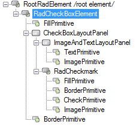
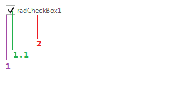

# Structure

This article will show the internal elements structure of __RadCheckBox__:

>caption Figure 1: RadCheckBox's elements hierarchy

1. __RadCheckmark__  
	1\.1\. __CheckPrimitive__: represents the check primitive 
2. __TextPrimitive__: represents the checkbox's text

>caption Fig.2 RadCheckBox's structure

        
