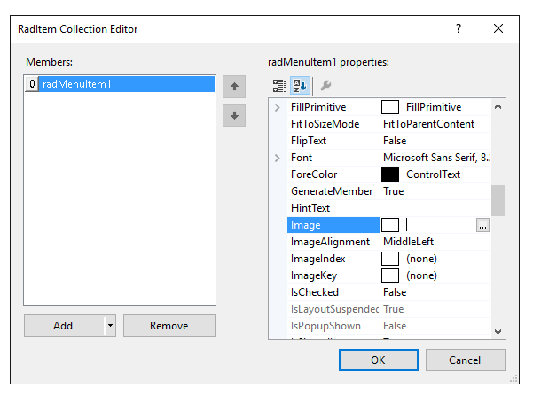
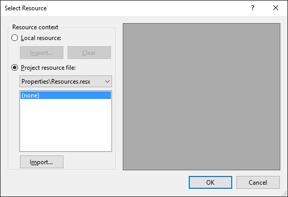

# Getting Started with WinForms DropDownButton

You can add __RadDropDownButton__ either at design time or at run time:

## Design Time

1. To add a __RadDropDownButton__ to your form, drag a __RadDropDownButton__ from the toolbox onto the surface of the form designer.
2. Like a standard button, you can control the displayed text by setting the __Text__ property.
3. Unlike a standard button, __RadDropDownButton__ displays drop-down items when clicked. So handling the __Click__ event of this button is not appropriate. Instead, work directly with the events for each item.

## Run Time

To programmatically add a __RadDropDownButton__ to a form, create a new instance of a __RadDropDownButton__, and add it to the form __Controls__ collection.

#### Adding a RadButton at runtime 

{{source=..\SamplesCS\Buttons\DropDownButton.cs region=CreatingButton}} 
{{source=..\SamplesVB\Buttons\DropDownButton.vb region=CreatingButton}} 

````C#
RadDropDownButton radDropDownButton = new RadDropDownButton();
radDropDownButton1.Text = "Fruits";
RadMenuItem item1 = new RadMenuItem("Orange");
radDropDownButton1.Items.Add(item1);
RadMenuItem item2 = new RadMenuItem("Lemon");
radDropDownButton1.Items.Add(item2);
RadMenuItem item3 = new RadMenuItem("Banana");
radDropDownButton1.Items.Add(item3);
this.Controls.Add(radDropDownButton);

````
````VB.NET
Dim radDropDownButton As New RadDropDownButton()
radDropDownButton1.Text = "Fruits"
Dim item1 As New RadMenuItem("Orange")
radDropDownButton1.Items.Add(item1)
Dim item2 As New RadMenuItem("Lemon")
radDropDownButton1.Items.Add(item2)
Dim item3 As New RadMenuItem("Banana")
radDropDownButton1.Items.Add(item3)
Me.Controls.Add(radDropDownButton)

````

{{endregion}} 


Similarly, you can create item hierarchies in code by adding new __RadMenuItem__ objects to the __Items__ collection of your existing __RadMenuItem__.

#### Adding sub items

{{source=..\SamplesCS\Buttons\DropDownButton1.cs region=itemsHierarchy}} 
{{source=..\SamplesVB\Buttons\DropDownButton1.vb region=itemsHierarchy}} 

````C#
using Telerik.WinControls.UI;
namespace RadDropDownButtonDemo
{
    public partial class Form1 : Form
    {
        private void Form1_Load(object sender, EventArgs e)
        {
            RadMenuItem mainItem = radDropDownButton1.Items[0] as RadMenuItem;
            RadMenuItem mySubMenuItem = new RadMenuItem();
            mySubMenuItem.Text = "Submenu Item";
            mySubMenuItem.Click += new EventHandler(mySubMenuItem_Click);
            mainItem.Items.Add(mySubMenuItem);
        }
        void mySubMenuItem_Click(object sender, EventArgs e)
        {
            MessageBox.Show((sender as RadMenuItem).Text +
                " was clicked.");
        }
    }
}

````
````VB.NET
Imports System.Windows.Forms
Imports Telerik.WinControls.UI
Namespace RadDropDownButtonDemo
    Public Class Form1
        Private Sub Form1_Load(ByVal sender As Object, ByVal e As EventArgs)
            Dim mainItem As RadMenuItem = TryCast(radDropDownButton1.Items(0), RadMenuItem)
            Dim mySubMenuItem As New RadMenuItem()
            mySubMenuItem.Text = "Submenu Item"
            AddHandler mySubMenuItem.Click, AddressOf mySubMenuItem_Click
            mainItem.Items.Add(mySubMenuItem)
        End Sub
        Sub mySubMenuItem_Click(ByVal sender As Object, ByVal e As EventArgs)
            MessageBox.Show((TryCast(sender, RadMenuItem)).Text + " was clicked.")
        End Sub
    End Class
End Namespace

````

{{endregion}} 
 

## Displaying Images with Items

You can display images and text on your menu items.



To add an image to your menu item, click in the __Image__ property of the __RadMenuItem__, and then click the ellipsis button to launch the __Select Resource__ dialog. From this dialog you can select an image file from a project resource file or from an image resource on your local hard drive. 



## Using the Click Event

To handle the __Click__ event of individual RadMenuItems on the drop down menu at Design Time, locate the  __RadMenuItem__ in the drop down list in the __Properties__ window of the Windows Form designer. Click the events button, then double-click the __Click__ event to generate an event handler. Then fill in your event-handling code.


## Telerik UI for WinForms Learning Resources
* [Telerik UI for WinForms DropDownButton Component](https://www.telerik.com/products/winforms/buttons.aspx)
* [Getting Started with Telerik UI for WinForms Components](https://docs.telerik.com/devtools/winforms/getting-started/first-steps)
* [Telerik UI for WinForms Setup](https://docs.telerik.com/devtools/winforms/installation-and-upgrades/installing-on-your-computer)
* [Telerik UI for WinForms Application Modernization](https://docs.telerik.com/devtools/winforms/winforms-converter/overview)
* [Telerik UI for WinForms Visual Studio Templates](https://docs.telerik.com/devtools/winforms/visual-studio-integration/visual-studio-templates)
* [Deploy Telerik UI for WinForms Applications](https://docs.telerik.com/devtools/winforms/deployment-and-distribution/application-deployment)
* [Telerik UI for WinForms Virtual Classroom(Training Courses for Registered Users)](https://learn.telerik.com/learn/course/external/view/elearning/17/telerik-ui-for-winforms)
* [Telerik UI for WinForms License Agreement)](https://www.telerik.com/purchase/license-agreement/winforms-dlw-s)

