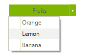
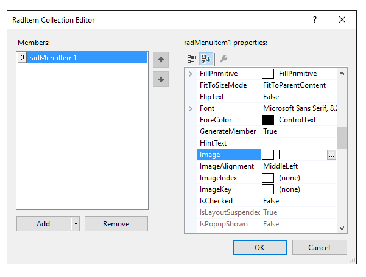
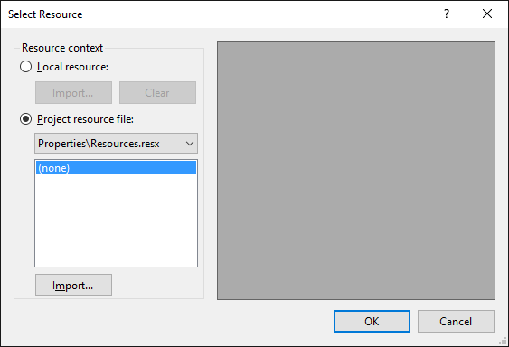

# Getting Started with WinForms DropDownButton

This article shows how you can start using `RadDropDownButton`.

## Adding Telerik Assemblies Using NuGet

To use `RadDropDownButton` when working with NuGet packages, install the `Telerik.UI.for.WinForms.AllControls` package. The [package target framework version may vary]().

Read more about NuGet installation in the [Install using NuGet Packages]() article.

>tip With the 2025 Q1 release, the Telerik UI for WinForms has a new licensing mechanism. You can learn more about it [here]().

## Adding Assembly References Manually

When dragging and dropping a control from the Visual Studio (VS) Toolbox onto the Form Designer, VS automatically adds the necessary assemblies. However, if you're adding the control programmatically, you'll need to manually reference the following assemblies:

* __Telerik.Licensing.Runtime__
* __Telerik.WinControls__
* __Telerik.WinControls.UI__
* __TelerikCommon__

The Telerik UI for WinForms assemblies can be install by using one of the available [installation approaches](). 

## Defining the RadDropDownButton

You can add __RadDropDownButton__ either at design time or at run time:

### Design Time

1. To add a __RadDropDownButton__ to your form, drag a __RadDropDownButton__ from the toolbox onto the surface of the form designer.
2. Like a standard button, you can control the displayed text by setting the __Text__ property.
3. Unlike a standard button, __RadDropDownButton__ displays drop-down items when clicked. So handling the __Click__ event of this button is not appropriate. Instead, work directly with the events for each item.

### Run Time

To programmatically add a __RadDropDownButton__ to a form, create a new instance of a __RadDropDownButton__, and add it to the form __Controls__ collection.

#### Adding a RadButton at runtime 

<snippet id='buttons-dropdownbutton-getting-started-creatingbutton-cs' />
<snippet id='buttons-dropdownbutton-getting-started-creatingbutton-vb' />

Similarly, you can create item hierarchies in code by adding new __RadMenuItem__ objects to the __Items__ collection of your existing __RadMenuItem__.

#### Adding sub items

<snippet id='buttons-dropdownbutton-working-with-raddropdownbutton-items-itemshierarchy-cs' />
<snippet id='buttons-dropdownbutton-working-with-raddropdownbutton-items-itemshierarchy-vb' />

 

### Displaying Images with Items

You can display images and text on your menu items.

To add an image to your menu item, click in the __Image__ property of the __RadMenuItem__, and then click the ellipsis button to launch the __Select Resource__ dialog. From this dialog you can select an image file from a project resource file or from an image resource on your local hard drive. 

### Using the Click Event

To handle the __Click__ event of individual RadMenuItems on the drop down menu at Design Time, locate the  __RadMenuItem__ in the drop down list in the __Properties__ window of the Windows Form designer. Click the events button, then double-click the __Click__ event to generate an event handler. Then fill in your event-handling code.

## Telerik UI for WinForms Learning Resources
* [Telerik UI for WinForms DropDownButton Component](https://www.telerik.com/products/winforms/buttons.aspx)
* [Getting Started with Telerik UI for WinForms Components](https://docs.telerik.com/devtools/winforms/getting-started/first-steps)
* [Telerik UI for WinForms Setup](https://docs.telerik.com/devtools/winforms/installation-and-upgrades/installing-on-your-computer)
* [Telerik UI for WinForms Converter](https://www.telerik.com/products/winforms/documentation/ai-coding-assistant/converter/converter)
* [Telerik UI for WinForms Visual Studio Templates](https://docs.telerik.com/devtools/winforms/visual-studio-integration/visual-studio-templates)
* [Deploy Telerik UI for WinForms Applications](https://docs.telerik.com/devtools/winforms/deployment-and-distribution/application-deployment)
* [Telerik UI for WinForms Virtual Classroom(Training Courses for Registered Users)](https://learn.telerik.com/learn/course/external/view/elearning/17/telerik-ui-for-winforms)
* [Telerik UI for WinForms License Agreement)](https://www.telerik.com/purchase/license-agreement/winforms-dlw-s)

