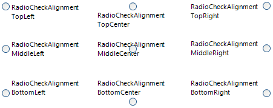
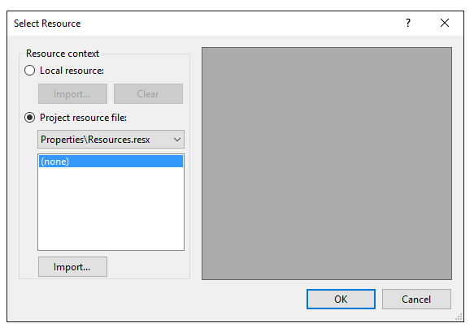

# Designing RadRadioButton 

## RadioButton Grouping

__RadRadioButtons__ are grouped according to their parent. You can place a set of __RadRadioButtons__ on a panel so that the choices made will be mutually exclusive, i.e. when one radio button is chosen, the others are deselected. By including multiple parents with their own __RadRadioButtons__ you can have multiple groups of radio buttons acting independently. See the [Getting Started tutorial]() for an example.

Use __RadioCheckAlignment__ to control where the radio button appears in relation to the text of the control. 

## Adding Images

To add an image to RadRadioButton, click on the __Image__ property (the ellipsis button) to launch the __Select Resource__ dialog. Use the Import button to load image files as a Local Resource, i.e. for that radio button only, or as a Project resource file where other components can share the same images.

## Text and Image Layout

Use the __TextImageRelation__ property to align the image with text. Note that the value of this property is independent of the value of __RadioCheckAlignment__. As shown in the image below, setting __RadioCheckAlignment__ to __MiddleRight__ and setting __TextImageRelation__ to __TextBeforeImage__ will result in the image being placed between the text and the check box. 	

<snippet id='buttons-radiobutton-designing-radradiobutton-alignments-cs' />
<snippet id='buttons-radiobutton-designing-radradiobutton-alignments-vb' />

## Text Entry

To add multiple lines to radio button text in code use the newline "\n" character or System.Environment.NewLine. 

#### Adding multiple lines 

<snippet id='buttons-radiobutton-designing-radradiobutton-settingtext-cs' />
<snippet id='buttons-radiobutton-designing-radradiobutton-settingtext-vb' />

