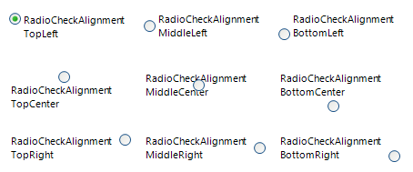
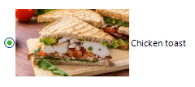
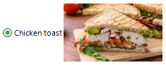
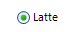

# Properties

|Property|Description|Result|
|----|----|----|
|__RadioCheckAlignment__|Gets or sets a value indicating the alignment of the radio button.||
|__Image__|Gets or sets the image that is displayed on the radio button control. To add an image to __RadRadioButton__ at design time, click on the __Image__ property (the ellipsis button) to launch the *Select Resource dialog*. Use the `Import` button to load image files as a Local Resource, i.e. for that radio button only, or as a Project resource file where other components can share the same images.||
|__TextImageRelation__|Gets or sets the position of text and image relative to each other. Note that the value of this property is independent of the value of __RadioCheckAlignment__. Setting the __RadioCheckAlignment__ property to *MiddleRight* and setting __TextImageRelation__ to *TextBeforeImage* will result in the image being placed between the text and the check box.||
|__Text__|Gets or sets the text associated with the drop down button control.||
|__DisplayStyle__|Defines the display image and text style of an item.   *None*: Specifies that neither image nor text is rendered.   *Text*: Specifies that only text is rendered.   *Image*: Specifies that only an image is rendered.   *ImageAndText*: Specifies that both an image and text are to be rendered. ||
|__ButtonElement__|Gets the instance of __RadRadioButtonElement__ wrapped by this control. __RadRadioButtonElement__ is the main element in the hierarchy tree and encapsulates the actual functionality of __RadRadioButton__.||
|__ToggleState__|Gets or sets the toggle state. Toggle state enumeration defines the following values: Off, Indeterminate, and On.
|__CheckState__ \*|Gets or sets the check state. Check state enumeration defines the following values: Uncheck, Indeterminate, and Check.|
|__AutoCheck__|Gets or sets a value indicating whether the **IsChecked** value and the appearance of the control automatically change when the control is clicked. |

>note **AutoCheck** property is available as of R3 2023. When the **RadRadioButton** is part of a group and the **AutoCheck** property is set to *true*, this ensures that only one radio button is checked at a given time. If the **AutoCheck** property is set to *false*, the group of buttons will not act as a mutually exclusive group and the **IsChecked** property should be updated in code.

# Methods

|Method|Description|
|----|----|
|__PerformClick__|Generates a Click event for a radio button.||

# Events

|Event|Description|
|----|----|
|__ToggleStateChanging__|Occurs before the item's toggle state changes.|
|__ToggleStateChanged__|Occurs when the elements's state changes.|
|__CheckStateChanging__|Occurs before the elements's check state changes.|
|__CheckStateChanged__|Occurs when the elements's check state changes.|

>important Due to the specifics of the [simple data binding](http://msdn.microsoft.com/en-us/library/system.windows.forms.binding(v=vs.110).aspx) we have introduced the __CheckStateChanging__ and __CheckStateChanged__ events together with the __CheckState__ property. These events and property provide the same functionality as the __ToggleStateChanged__, __ToggleStateChanging__ and the __ToggleState__ property, but give you the ability to simple data bind the control.
>

# See Also 
* [Properties](https://docs.telerik.com/devtools/winforms/api/telerik.wincontrols.ui.radradiobutton.html#properties)
* [Methods](https://docs.telerik.com/devtools/winforms/api/telerik.wincontrols.ui.radradiobutton.html#methods)
* [Events](https://docs.telerik.com/devtools/winforms/api/telerik.wincontrols.ui.radtogglebutton.html#events)
