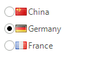

# RadioButton

__RadRadioButton__ replaces the WinForms RadioButton control and adds robust data binding, state management, and design options. 





To begin using __RadRadioButton__ see the [Getting Started]() section. To learn about the significant properties for __RadRadioButton__, including how radio buttons are grouped, multiple lines of text, how to assign images and layout for text, radio mark and image see the [Properties, Methods and Events]() topic. Learn how to react to user input in [Handling RadRadioButton States]() topic.
