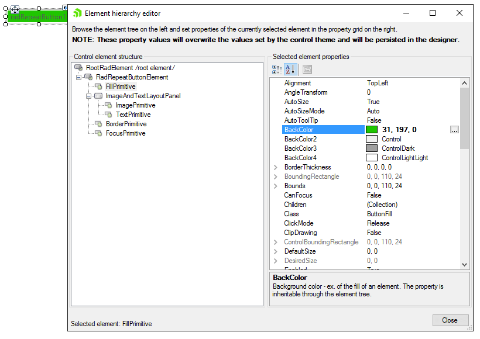
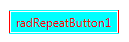

# Accessing and Customizing Elements
 
Accessing and customizing elements can be performed either at design time, or at run time. Before proceeding with this topic, it is recommended to get familiar with the [visual structure]() of the __RadRepeatButton__.
      

## Design time

You can access and modify the style for different elements in __RadRepeatButton__ by using the Element hierarchy editor. It can be accessed by selecting the *Edit UI Elements* item from the Smart Tag.


>caption Figure 1: Element hierarchy editor



## Programmatically

You can customize the nested elements at run time as well:
>caption Figure 2: Customize elements



#### Customize elements 

{{source=..\SamplesCS\Buttons\RepeatButton.cs region=AccessingCustomizingElements}} 
{{source=..\SamplesVB\Buttons\RepeatButton.vb region=AccessingCustomizingElements}} 

````C#
this.radRepeatButton1.ButtonElement.TextElement.ForeColor = Color.Red;
this.radRepeatButton1.ButtonElement.ButtonFillElement.BackColor = Color.Aqua;
this.radRepeatButton1.ButtonElement.BorderElement.BoxStyle = Telerik.WinControls.BorderBoxStyle.FourBorders;
this.radRepeatButton1.ButtonElement.BorderElement.TopColor = Color.Aqua;
this.radRepeatButton1.ButtonElement.BorderElement.BottomColor = Color.Aqua;
this.radRepeatButton1.ButtonElement.BorderElement.LeftColor = Color.Red;
this.radRepeatButton1.ButtonElement.BorderElement.RightColor = Color.Red;

````
````VB.NET
Me.radRepeatButton1.ButtonElement.TextElement.ForeColor = Color.Red
Me.radRepeatButton1.ButtonElement.ButtonFillElement.BackColor = Color.Aqua
Me.radRepeatButton1.ButtonElement.BorderElement.BoxStyle = Telerik.WinControls.BorderBoxStyle.FourBorders
Me.radRepeatButton1.ButtonElement.BorderElement.TopColor = Color.Aqua
Me.radRepeatButton1.ButtonElement.BorderElement.BottomColor = Color.Aqua
Me.radRepeatButton1.ButtonElement.BorderElement.LeftColor = Color.Red
Me.radRepeatButton1.ButtonElement.BorderElement.RightColor = Color.Red

````

{{endregion}} 
