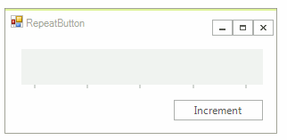

# RepeatButton

__RadRepeatButton__ provides press-and-hold functionality. While the mouse button is pressed down, the __ButtonClick__ event fires at a pre-determined interval. __RadRepeatButton__ is an ideal UI element for allowing users to control an increasing or decreasing value, such as volume or brightness. To learn how to use the __RadRepeatButton__, see [Getting Started with the Telerik RadRepeatButton](). As with all other controls in the Telerik UI for WinForms suite, __RadRepeatButton__ is themable and also has a set of predefined themes.
 




