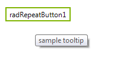
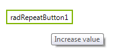

# Tooltips

There are two ways to assign tooltips to __RadRepeatButton__, namely setting the __ToolTipText__ property of the __RadRepeatButtonElement__, or as in most of the RadControls by using the __ToolTipTextNeeded__ event of __RadRepeatButton__. It is necessary the __ShowItemToolTips__ property to be set to *true* which is the default value.

#### Setting the ToolTipText property

<snippet id='buttons-repeatbutton-tooltips-settooliptext-cs' />
<snippet id='buttons-repeatbutton-tooltips-settooliptext-vb' />

#### Setting tool tips in the ToolTipTextNeeded event

<snippet id='buttons-repeatbutton-tooltips-tooltiptextneeded-cs' />
<snippet id='buttons-repeatbutton-tooltips-tooltiptextneeded-vb' />

>note The __ToolTipTextNeeded__ event has higher priority and overrides the tool tips set in the __ToolTipText__ property.

 
