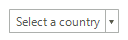
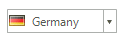
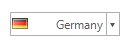
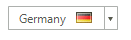
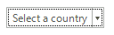
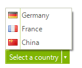

# Properties

|Property|Description|Result|
|----|----|----|
|__Text__|Gets or sets the text associated with the drop down  button control||
|__Image__|Gets or sets the image that is displayed on the button control||
|__TextAlignment__|Gets or sets the alignment of the text on the button control||
|__TextImageRelation__|Gets or sets the position of text and image relative to each other||
|__AllowShowFocusCues__|Indicates focus cues display, when available, based on the corresponding control type and the current UI state||
|__DisplayStyle__|Specifies the options for display of image and text primitives in the control||
|__DropDownDirection__|Gets or sets a value indicating the direction in which the dropdown item emerges from its parent container||
|__ShowArrow__|Gets or sets a value indicating whether the arrow is shown||
|__Items__|Gets or set the __RadItemOwnerCollection__ that stores the drop down items||

# Methods

|Method|Description|
|----|----|
|__ShowDropDown__|Shows the pop up with items|
|__HideDropDown__|Hides the pop up with items|

# Events

|Event|Description|
|----|----|
|__DropDownOpening__|Occurs when the drop-down window is about to open|
|__DropDownOpened__|Occurs when the drop down is opened|
|__DropDownClosed__|Occurs when the drop down is closed|

# See Also 
* [Properties](http://docs.telerik.com/devtools/winforms/api/html/Properties_T_Telerik_WinControls_UI_RadSplitButton.htm)
* [Methods](http://docs.telerik.com/devtools/winforms/api/html/Methods_T_Telerik_WinControls_UI_RadSplitButton.htm)
* [Events](http://docs.telerik.com/devtools/winforms/api/html/Events_T_Telerik_WinControls_UI_RadSplitButton.htm)