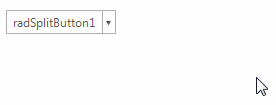

# Tooltips

There are two ways to assign tooltips to __RadSplitButton__, namely setting the __ToolTipText__ property of the __RadSplitButtonElement__, or as in most of the RadControls by using the __ToolTipTextNeeded__ event of __RadSplitButton__. It is necessary the __ShowItemToolTips__ property to be set to *true* which is the default value.

#### Setting the ToolTipText property

{{source=..\SamplesCS\Buttons\SplitButton.cs region=SetToolTipText}} 
{{source=..\SamplesVB\Buttons\SplitButton.vb region=SetToolTipText}}

````C#
this.radSplitButton1.DropDownButtonElement.ToolTipText = "sample tooltip";

````
````VB.NET
Me.radSplitButton1.DropDownButtonElement.ToolTipText = "sample tooltip"

````

{{endregion}} 

>note In order to assign different tooltips for the action part and the arrow button, you must specify the __ToolTipText__ property of the RadSplitButtonElement.__ActionButton__ or RadSplitButtonElement.__ArrowButton__ element.



#### Setting tool tips in the ToolTipTextNeeded event

{{source=..\SamplesCS\Buttons\SplitButton.cs region=ToolTipTextNeeded}} 
{{source=..\SamplesVB\Buttons\SplitButton.vb region=ToolTipTextNeeded}}

````C#
private void RadSplitButton1_ToolTipTextNeeded(object sender, Telerik.WinControls.ToolTipTextNeededEventArgs e)
{
    ActionButtonElement actionButtonElement = sender as ActionButtonElement;
    RadArrowButtonElement arrowButtonElement = sender as RadArrowButtonElement;
    if (actionButtonElement != null)
    {
        e.ToolTipText = "ActionButtonElement";
    }
    else if (arrowButtonElement != null)
    {
        e.ToolTipText = "RadArrowButtonElement";
    }
}

````
````VB.NET
Private Sub RadSplitButton1_ToolTipTextNeeded(sender As Object, e As Telerik.WinControls.ToolTipTextNeededEventArgs)
    Dim actionButtonElement As ActionButtonElement = TryCast(sender, ActionButtonElement)
    Dim arrowButtonElement As RadArrowButtonElement = TryCast(sender, RadArrowButtonElement)
    If actionButtonElement IsNot Nothing Then
        e.ToolTipText = "ActionButtonElement"
    ElseIf arrowButtonElement IsNot Nothing Then
        e.ToolTipText = "RadArrowButtonElement"
    End If
End Sub

````

{{endregion}} 


>note The __ToolTipTextNeeded__ event has higher priority and overrides the tool tips set in  the __ToolTipText__ property.

