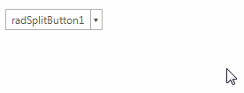
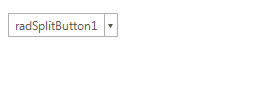

# Tooltips

There are two ways to assign tooltips to __RadSplitButton__, namely setting the __ToolTipText__ property of the __RadSplitButtonElement__, or as in most of the RadControls by using the __ToolTipTextNeeded__ event of __RadSplitButton__. It is necessary the __ShowItemToolTips__ property to be set to *true* which is the default value.

#### Setting the ToolTipText property

<snippet id='buttons-splitbutton-tooltips-settooliptext-cs' />
<snippet id='buttons-splitbutton-tooltips-settooliptext-vb' />

>note In order to assign different tooltips for the action part and the arrow button, you must specify the __ToolTipText__ property of the RadSplitButtonElement.__ActionButton__ or RadSplitButtonElement.__ArrowButton__ element.

#### Setting tool tips in the ToolTipTextNeeded event

<snippet id='buttons-splitbutton-tooltips-tooltiptextneeded-cs' />
<snippet id='buttons-splitbutton-tooltips-tooltiptextneeded-vb' />

>note The __ToolTipTextNeeded__ event has higher priority and overrides the tool tips set in  the __ToolTipText__ property.

