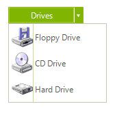

# Getting Started

You can add ____ either at design time or at run time:

## Design Time

1. To add a __RadSplitButton__ to your form, drag a __RadSplitButton__ from the toolbox onto the surface of the form designer. 
2. Like a standard button, you can control the displayed text by setting the __Text__ property. 
3. Unlike a standard button, __RadSplitButton__ displays drop-down items when clicked. So handling the __Click__ event of this button is not appropriate. Instead, work directly with the events for each item.

## Run Time

To programmatically add a __RadSplitButton__ to a form, create a new instance of a __RadSplitButton__, and add it to the form __Controls__ collection.

#### Adding a RadSplitButton at runtime 

{{source=..\SamplesCS\Buttons\SplitButton.cs region=CreatingButton}} 
{{source=..\SamplesVB\Buttons\SplitButton.vb region=CreatingButton}} 

````C#
RadSplitButton splitButton = new RadSplitButton();
splitButton.Text = "Fruits";
RadMenuItem item1 = new RadMenuItem("Orange");
splitButton.Items.Add(item1);
RadMenuItem item2 = new RadMenuItem("Lemon");
splitButton.Items.Add(item2);
RadMenuItem item3 = new RadMenuItem("Banana");
splitButton.Items.Add(item3);
this.Controls.Add(splitButton);

````
````VB.NET
Dim splitButton As New RadSplitButton()
splitButton.Text = "Fruits"
Dim item1 As New RadMenuItem("Orange")
splitButton.Items.Add(item1)
Dim item2 As New RadMenuItem("Lemon")
splitButton.Items.Add(item2)
Dim item3 As New RadMenuItem("Banana")
splitButton.Items.Add(item3)
Me.Controls.Add(splitButton)

````

{{endregion}} 

# Working with RadSplitButton Items

The heart of __RadSplitButton__ is the __Items__ collection. This collection defines the menu items that appear when the __RadSplitButton__ is clicked. There are two ways to add items to a __RadSplitButton__.

## Adding Items at Design-time in the UI

To add menu items at design-time, please refer to the [Design Time]() help article.

## Adding Items at Run Time in Code

You can also add items to __RadSplitButton__ in code at run time. The following example code illustrates programmatically adding a __RadMenuItem__ to your button.

#### Adding a RadMenuItem 

{{source=..\SamplesCS\Buttons\SplitButton.cs region=items}} 
{{source=..\SamplesVB\Buttons\SplitButton.vb region=items}} 

````C#
private void Form1_Load(object sender, EventArgs e)
{
    RadMenuItem myRadMenuItem = new RadMenuItem();
    myRadMenuItem.Text = "My New Item";
    myRadMenuItem.Click += new EventHandler(myRadMenuItem_Click);
    radSplitButton1.Items.Add(myRadMenuItem);
}
void myRadMenuItem_Click(object sender, EventArgs e)
{
    MessageBox.Show((sender as RadMenuItem).Text);
}

````
````VB.NET
Private Sub Form1_Load(ByVal sender As System.Object, ByVal e As System.EventArgs) Handles MyBase.Load
    Dim myRadMenuItem As New RadMenuItem()
    myRadMenuItem.Text = "My New Item"
    AddHandler myRadMenuItem.Click, AddressOf myRadMenuItem_Click
    radSplitButton1.Items.Add(myRadMenuItem)
End Sub
Sub myRadMenuItem_Click(ByVal sender As Object, ByVal e As EventArgs)
    MessageBox.Show((TryCast(sender, RadMenuItem)).Text)
End Sub

````

{{endregion}} 
 
Create item hierarchies in code by adding new __RadMenuItem__ objects to the __Items__ collection of your existing __RadMenuItem__.

#### Adding a sub item 

{{source=..\SamplesCS\Buttons\SplitButton1.cs region=subitems}} 
{{source=..\SamplesVB\Buttons\SplitButton1.vb region=subitems}} 

````C#
private void Form1_Load(object sender, EventArgs e)
{
    radSplitButton1.Items.Add(new RadMenuItem("AAA"));
    RadMenuItem mySubMenuItem = new RadMenuItem();
    mySubMenuItem.Text = "Submenu Item";
    mySubMenuItem.Click += new EventHandler(mySubMenuItem_Click);
    RadMenuItem mainItem = radSplitButton1.Items[0] as RadMenuItem;
    mainItem.Items.Add(mySubMenuItem);
}
void mySubMenuItem_Click(object sender, EventArgs e)
{
    MessageBox.Show((sender as RadMenuItem).Text);
}

````
````VB.NET
Private Sub Form1_Load(ByVal sender As System.Object, ByVal e As System.EventArgs) Handles MyBase.Load
    Dim mySubMenuItem As New RadMenuItem()
    mySubMenuItem.Text = "Submenu Item"
    AddHandler mySubMenuItem.Click, AddressOf mySubMenuItem_Click
    Dim mainItem As RadMenuItem = TryCast(radSplitButton1.Items(0), RadMenuItem)
    mainItem.Items.Add(mySubMenuItem)
End Sub
Sub mySubMenuItem_Click(ByVal sender As Object, ByVal e As EventArgs)
    MessageBox.Show((TryCast(sender, RadMenuItem)).Text)
End Sub

````

{{endregion}} 
 
## Displaying Images with Items

You can display images as well as text on your menu items.



To add an image to your menu item, click in the __Image__ property of the __RadMenuItem__, and then click the ellipsis button to launch the __Select Resource__ dialog.


From this dialog you can select an image file from a project resource file or from an image resource on your local hard drive. 

## Using the Click Event

To handle the __Click__ event of __RadMenuItems__ on the drop down menu, locate the __RadMenuItem__ in the drop down list in the Properties window of the Windows Form designer. Click the events button, then double-click the __Click__ event to generate an event handler. Fill in the details of your event-handling code.

## Setting the Default Item

The default item is the item whose __Click__ event is triggered by the user pressing the button, instead of choosing from the menu. The __DefaultItem__ can be assigned in code: 

#### Assigning the default item 

{{source=..\SamplesCS\Buttons\SplitButton1.cs region=mainItem}} 
{{source=..\SamplesVB\Buttons\SplitButton1.vb region=mainItem}} 

````C#
radSplitButton1.DefaultItem = mainItem;

````
````VB.NET
radSplitButton1.DefaultItem = mainItem

````

{{endregion}} 


