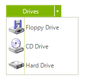

# Getting Started with WinForms SplitButton

This article shows how you can start using __RadSplitButton__.

## Adding Telerik Assemblies Using NuGet

To use __RadSplitButton__ when working with NuGet packages, install the `Telerik.UI.for.WinForms.AllControls` package. The [package target framework version may vary]().

Read more about NuGet installation in the [Install using NuGet Packages]() article.

>tip With the 2025 Q1 release, the Telerik UI for WinForms has a new licensing mechanism. You can learn more about it [here]().

## Adding Assembly References Manually

When dragging and dropping a control from the Visual Studio (VS) Toolbox onto the Form Designer, VS automatically adds the necessary assemblies. However, if you're adding the control programmatically, you'll need to manually reference the following assemblies:

* __Telerik.Licensing.Runtime__
* __Telerik.WinControls__
* __Telerik.WinControls.UI__
* __TelerikCommon__

The Telerik UI for WinForms assemblies can be install by using one of the available [installation approaches](). 

## Defining the RadSplitButton

You can add __RadSplitButton__ either at design time or at run time:

### Design Time

1. To add a __RadSplitButton__ to your form, drag a __RadSplitButton__ from the toolbox onto the surface of the form designer. 
2. Like a standard button, you can control the displayed text by setting the __Text__ property. 
3. Unlike a standard button, __RadSplitButton__ displays drop-down items when clicked. So handling the __Click__ event of this button is not appropriate. Instead, work directly with the events for each item.

### Run Time

To programmatically add a __RadSplitButton__ to a form, create a new instance of a __RadSplitButton__, and add it to the form __Controls__ collection.

#### Adding a RadSplitButton at runtime 

<snippet id='buttons-splitbutton-working-with-radsplitbutton-items-creatingbutton-cs' />
<snippet id='buttons-splitbutton-working-with-radsplitbutton-items-creatingbutton-vb' />

### Working with RadSplitButton Items

The heart of __RadSplitButton__ is the __Items__ collection. This collection defines the menu items that appear when the __RadSplitButton__ is clicked. There are two ways to add items to a __RadSplitButton__.

### Adding Items at Design-time in the UI

To add menu items at design-time, please refer to the [Design Time]() help article.

### Adding Items at Run Time in Code

You can also add items to __RadSplitButton__ in code at run time. The following example code illustrates programmatically adding a __RadMenuItem__ to your button.

#### Adding a RadMenuItem 

<snippet id='buttons-splitbutton-working-with-radsplitbutton-items-items-cs' />
<snippet id='buttons-splitbutton-working-with-radsplitbutton-items-items-vb' />

Create item hierarchies in code by adding new __RadMenuItem__ objects to the __Items__ collection of your existing __RadMenuItem__.

#### Adding a sub item 

<snippet id='buttons-splitbutton-working-with-radsplitbutton-items-subitems-cs' />
<snippet id='buttons-splitbutton-working-with-radsplitbutton-items-subitems-vb' />

### Displaying Images with Items

You can display images as well as text on your menu items.

To add an image to your menu item, click in the __Image__ property of the __RadMenuItem__, and then click the ellipsis button to launch the __Select Resource__ dialog.

From this dialog you can select an image file from a project resource file or from an image resource on your local hard drive.

### Using the Click Event

To handle the __Click__ event of __RadMenuItems__ on the drop down menu, locate the __RadMenuItem__ in the drop down list in the Properties window of the Windows Form designer. Click the events button, then double-click the __Click__ event to generate an event handler. Fill in the details of your event-handling code.

### Setting the Default Item

The default item is the item whose __Click__ event is triggered by the user pressing the button, instead of choosing from the menu. The __DefaultItem__ can be assigned in code: 

#### Assigning the default item 

<snippet id='buttons-splitbutton-working-with-radsplitbutton-items-mainitem-cs' />
<snippet id='buttons-splitbutton-working-with-radsplitbutton-items-mainitem-vb' />

## Telerik UI for WinForms Learning Resources
* [Telerik UI for WinForms SplitButton Component](https://www.telerik.com/products/winforms/buttons.aspx)
* [Getting Started with Telerik UI for WinForms Components](https://docs.telerik.com/devtools/winforms/getting-started/first-steps)
* [Telerik UI for WinForms Setup](https://docs.telerik.com/devtools/winforms/installation-and-upgrades/installing-on-your-computer)
* [Telerik UI for WinForms Application Modernization](https://docs.telerik.com/devtools/winforms/winforms-converter/overview)
* [Telerik UI for WinForms Visual Studio Templates](https://docs.telerik.com/devtools/winforms/visual-studio-integration/visual-studio-templates)
* [Deploy Telerik UI for WinForms Applications](https://docs.telerik.com/devtools/winforms/deployment-and-distribution/application-deployment)
* [Telerik UI for WinForms Virtual Classroom(Training Courses for Registered Users)](https://learn.telerik.com/learn/course/external/view/elearning/17/telerik-ui-for-winforms)
* [Telerik UI for WinForms License Agreement)](https://www.telerik.com/purchase/license-agreement/winforms-dlw-s)

