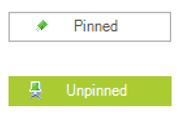

# WinForms ToggleButton Overview

__RadToggleButton__ is designed to manage states on your form. It shares many features with the [RadCheckBox](), but provides a different visual effect than the standard check mark. 





To learn how to act on state changes and alter the appearance of __RadToggleButton__ for different states, see [Handling the ToggleButton States]().

## Telerik UI for WinForms Learning Resources
* [Telerik UI for WinForms ToggleButton Homepage](https://www.telerik.com/products/winforms/buttons.aspx)
* [Get Started with the Telerik UI for WinForms ToggleButton]()
* [Telerik UI for WinForms API Reference](https://docs.telerik.com/devtools/winforms/api/)
* [Getting Started with Telerik UI for WinForms Components]()
* [Telerik UI for WinForms Virtual Classroom (Training Courses for Registered Users)](https://learn.telerik.com/learn/course/external/view/elearning/17/TelerikUIforWinForms) 
* [Telerik UI for WinForms Forum](https://www.telerik.com/forums/winforms)
* [Telerik UI for WinForms Knowledge Base](https://docs.telerik.com/devtools/winforms/knowledge-base)

