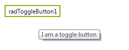
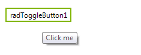

# Tooltips

There are two ways to assign tooltips to __RadToggleButton__, namely setting the __ToolTipText__ property of the __RadToggleButtonElement__, or as in most of the RadControls by using the __ToolTipTextNeeded__ event of __RadToggleButton__. It is necessary the __ShowItemToolTips__ property to be set to *true* which is the default value.

#### Setting the ToolTipText property

{{source=..\SamplesCS\Buttons\ToggleButton.cs region=SetToolTipText}} 
{{source=..\SamplesVB\Buttons\ToggleButton.vb region=SetToolTipText}}

````C#
this.radToggleButton1.ButtonElement.ToolTipText = "I am a toggle button";

````
````VB.NET
Me.radToggleButton1.ButtonElement.ToolTipText = "I am a toggle button"

````

{{endregion}} 



#### Setting tool tips in the ToolTipTextNeeded event

{{source=..\SamplesCS\Buttons\ToggleButton.cs region=ToolTipTextNeeded}} 
{{source=..\SamplesVB\Buttons\ToggleButton.vb region=ToolTipTextNeeded}}

````C#
private void RadToggleButton1_ToolTipTextNeeded(object sender, Telerik.WinControls.ToolTipTextNeededEventArgs e)
{
    e.ToolTipText = "Click me";
}

````
````VB.NET
Private Sub RadToggleButton1_ToolTipTextNeeded(sender As Object, e As Telerik.WinControls.ToolTipTextNeededEventArgs)
    e.ToolTipText = "Click me"
End Sub

````

{{endregion}} 



>note The __ToolTipTextNeeded__ event has higher priority and overrides the tool tips set in  the __ToolTipText__ property.

 
