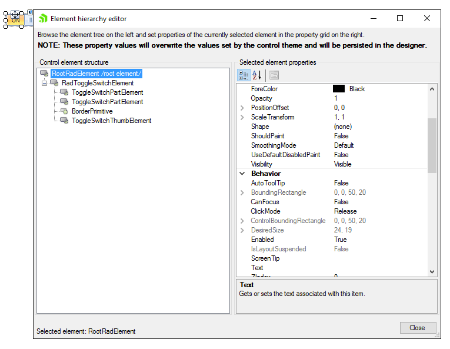
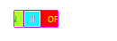

# Accessing and Customizing Elements

## Design time

You can access and modify the style for different elements in __RadToggleSwitch__ by using the *Element hierarchy editor*. Before proceeding with this topic, it is recommended to get familiar with the [visual structure]() of the __RadToggleSwitch__.
        
>caption Figure 1: Element hierarchy editor

## Programmatically

You can customize the nested elements at run time as well:
>caption Figure 2:

__Customizing elements at run time__

<snippet id='buttons-toggleswitch-accessing-and-customizing-elements-customizeelements-cs' />
<snippet id='buttons-toggleswitch-accessing-and-customizing-elements-customizeelements-vb' />