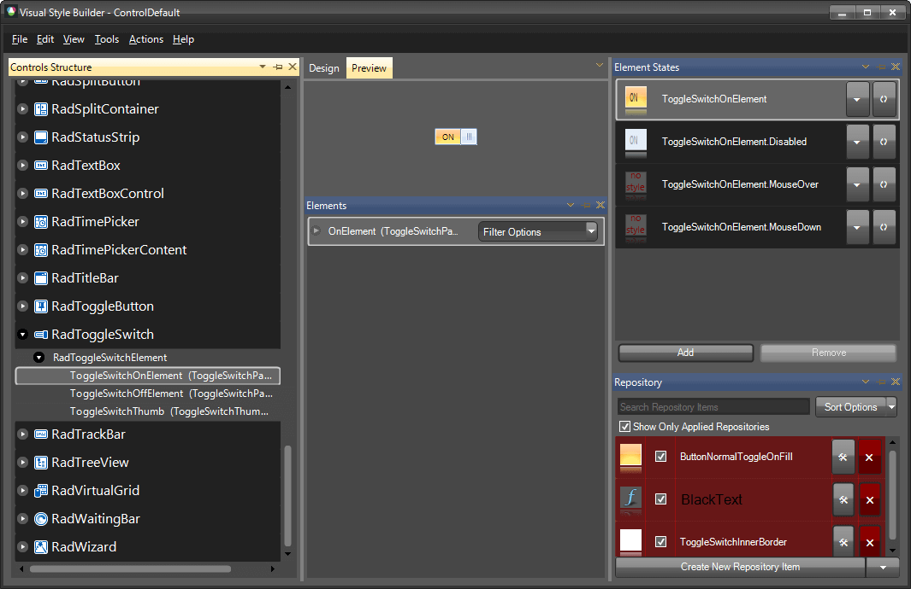

# Themes

This help article will demonstrate a step by step tutorial how to customize the ControlDefault theme for __RadToggleSwitch__ 

1. Open [VisualStyleBuilder](): Start menu (Start >> Programs >> Telerik >> UI for WinForms [version] >> Tools).

1. Export the built-in themes in a specific folder by selecting *File >> Export Built-in Themes*.

1. Load a desired theme from the just exported files by selecting *File >> Open Package*

1. Select __ToggleSwitchOnElement__ in *Controls Structure* on the left side. Then, select __OnElement__ in the *Elements* section.

	

1. Modify the applied back color. 

	

1. Save the theme by selecting *File >> Save As*.

1. Now, you can apply your custom theme to __RadToggleSwitch__ by using the demonstrated approach in the following link: [Using custom themes]()

# See Also 
* [Getting Started with VisualStyleBuilder]()
* [Working With Repository Items]()

