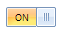

# Getting Started with WinForms ToggleSwitch

You can add a __RadToggleSwitch__ to your form either at design time or at run time:
        

## Design Time

1. Drag a __RadToggleSwitch__ from the toolbox and drop it onto the surface of the form’s designer.
2. Double click the __RadToggleSwitch__ at design time in order to generate the __ValueChanged__ event handler.
            
## Run Time

Adding __RadToggleSwitch__ programmatically: create a new instance of __RadToggleSwitch__ and add it to the Form.__Controls__ collection:
            

#### Adding RadToggleSwitch programmatically 


{{source=..\SamplesCS\Buttons\ToggleSwitch.cs region=AddProgrammatically}} 
{{source=..\SamplesVB\Buttons\ToggleSwitch.vb region=AddProgrammatically}} 

````C#
            
Telerik.WinControls.UI.RadToggleSwitch toggleSwitch = new Telerik.WinControls.UI.RadToggleSwitch();
this.Controls.Add(toggleSwitch);

````
````VB.NET
Dim toggleSwitch As New Telerik.WinControls.UI.RadToggleSwitch()
Me.Controls.Add(toggleSwitch)

````

{{endregion}} 


>caption Figure 1: RadToggleSwitch added at run time



## Telerik UI for WinForms Learning Resources
* [Telerik UI for WinForms Toggleswitch Component](https://www.telerik.com/products/winforms/buttons.aspx)
* [Getting Started with Telerik UI for WinForms Components](https://docs.telerik.com/devtools/winforms/getting-started/first-steps)
* [Telerik UI for WinForms Setup](https://docs.telerik.com/devtools/winforms/installation-and-upgrades/installing-on-your-computer)
* [Telerik UI for WinForms Application Modernization](https://docs.telerik.com/devtools/winforms/winforms-converter/overview)
* [Telerik UI for WinForms Visual Studio Templates](https://docs.telerik.com/devtools/winforms/visual-studio-integration/visual-studio-templates)
* [Deploy Telerik UI for WinForms Applications](https://docs.telerik.com/devtools/winforms/deployment-and-distribution/application-deployment)
* [Telerik UI for WinForms Virtual Classroom(Training Courses for Registered Users)](https://learn.telerik.com/learn/course/external/view/elearning/17/telerik-ui-for-winforms)
* [Telerik UI for WinForms License Agreement)](https://www.telerik.com/purchase/license-agreement/winforms-dlw-s)

