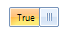
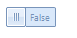
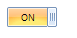
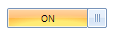
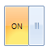

# Properties, Methods and Events

## Properties

|Property|Description|Result|
|----|----|----|
|__OnText__|Gets or sets the text displayed when the state is On. The default string is *"ON"*.||
|__OffText__|Gets or sets the text displayed when the state is Off. The default string is *"OFF"*.||
|__ThumbTickness__|Gets or sets width of the thumb. Its default value is *20*.||
|__SwitchElasticity__|Determines how far the switch needs to be dragged before it snaps to the opposite side. Its default value is *0.5*||
|__Value__|Gets or sets a boolean value. Its default value is *true*.||
|__AllowAnimation__|Gets or sets a value indicating whether to use animation when changing its state. The first RadToggleSwitch is with disabled animation.||
|__AnimationFrames__|Gets or sets the animation frames. Its default value is *20*.||
|__IsAnimating__|Gets a value indicating whether the control is currently animating.||
|__OnElement__|Gets the on element of __RadToggleSwitch__.||
|__OffElement__|Gets the off element of __RadToggleSwitch__.||
|__Thumb__|Gets the thumb of __RadToggleSwitch__.||
|__Width__|Gets or sets the width of __RadToggleSwitch__.| |
|__Height__|Gets or sets the height of __RadToggleSwitch__.||
|__ToggleStateMode__|Determines how ToggleSwitch button should handle mouse click and drag.|

## Methods

|Method|Description|
|----|----|
|__Toggle()__|Toggles the value of __RadToggleSwitch__.|
|__Toggle(bool animate)__|Toggles the value of __RadToggleSwitch__ indicating whether to use animation.|
|__SetToggleState(bool newValue)__|Sets the value of __RadToggleSwitch__ passing the new value as parameter.|
|__SetToggleState(bool newValue, bool animate)__|Sets the value of __RadToggleSwitch__. The first parameter specifies the new value and the second one indicates whether to use animation.|
         
## Events

|Event|Description|
|----|----|
|__ValueChanging__|It is a cancelable event which occurs when the __Value__ is about to change.|
|__ValueChanged__|Occurs when the __Value__ has changed.|
|__AnimationStarted__|Occurs when the animation starts.|
|__AnimationFinished__|Occurs when the animation finishes.|
            
# See Also 
* [Properties](https://docs.telerik.com/devtools/winforms/api/telerik.wincontrols.ui.radtoggleswitch.html#properties)
* [Methods](https://docs.telerik.com/devtools/winforms/api/telerik.wincontrols.ui.radtoggleswitch.html#methods)
* [Events](https://docs.telerik.com/devtools/winforms/api/telerik.wincontrols.ui.radtoggleswitch.html#events)
