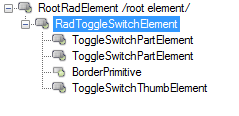
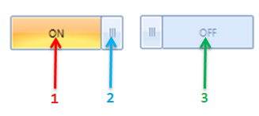

# Structure

This article will show the internal elements structure of __RadToggleSwitch__:

>caption Fiure 1: RadToggleSwitch's elements hierarchy

This article describes the inner structure and organization of the elements which build the __RadToggleSwitch__ control.
        
>caption Figure 2: RadToggleSwitch visual structure

1. __ToggleSwitchPartElement__: visual representation of the RadToggleSwitchElement.__OnElement__.
            

1. __ToggleSwitchThumbElement__: visual representation of the RadToggleSwitchElement.__Thumb__.
            

1. __ToggleSwitchPartElement__: visual representation of the RadToggleSwitchElement.__OffElement__.
            

>note Depending on the __Value__ only one of the __ToggleSwitchPartElement__ s is shown.
>

