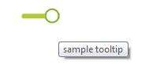
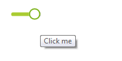

# Tooltips

There are two ways to assign tooltips to __RadToggleSwitch__, namely setting the __ToolTipText__ property of the __RadToggleSwitchElement__, or as in most of the RadControls by using the __ToolTipTextNeeded__ event of __RadToggleSwitch__. It is necessary the __ShowItemToolTips__ property to be set to *true* which is the default value.

#### Setting the ToolTipText property

{{source=..\SamplesCS\Buttons\ToggleSwitch.cs region=SetToolTipText}} 
{{source=..\SamplesVB\Buttons\ToggleSwitch.vb region=SetToolTipText}}

````C#
this.radToggleSwitch1.ToggleSwitchElement.ToolTipText = "sample tooltip";

````
````VB.NET
Me.RadToggleSwitch1.ToggleSwitchElement.ToolTipText = "sample tooltip"

````

{{endregion}} 



#### Setting tool tips in the ToolTipTextNeeded event

{{source=..\SamplesCS\Buttons\ToggleSwitch.cs region=ToolTipTextNeeded}} 
{{source=..\SamplesVB\Buttons\ToggleSwitch.vb region=ToolTipTextNeeded}}

````C#
private void RadToggleSwitch1_ToolTipTextNeeded(object sender, Telerik.WinControls.ToolTipTextNeededEventArgs e)
{
    e.ToolTipText = "Click me";
}

````
````VB.NET
Private Sub RadToggleSwitch1_ToolTipTextNeeded(sender As Object, e As Telerik.WinControls.ToolTipTextNeededEventArgs)
    e.ToolTipText = "Click me"
End Sub

````

{{endregion}} 



>note The __ToolTipTextNeeded__ event has higher priority and overrides the tool tips set in  the __ToolTipText__ property.

 