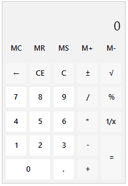
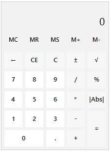

# Custom Functions

This article aims to show a sample approach how to create a custom function, |Abs|, for returning the absolute value of the current entry in the calculator. The `|Abs|` button will replace the `1/x` button:

|Default functions|Custom function|
|----|----|
|||
 
>note The exact implementation of the custom calculation is just a sample approach. It may be customized according to the specific custom requirements that need to be covered.

{{source=..\SamplesCS\Calculator\CalculatorGettingStarted.cs region=CustomFunction}} 
{{source=..\SamplesVB\Calculator\CalculatorGettingStarted.vb region=CustomFunction}} 

````C#

public class CustomCalculator : RadCalculator
{
    public override string ThemeClassName
    {
        get
        {
            return typeof(RadCalculator).FullName;
        }
    }
    protected override RadCalculatorElement CreateCalculatorElement()
    {
        return new CustomRadCalculatorElement();
    }
}

public class CustomRadCalculatorElement : RadCalculatorElement
{
    protected override Type ThemeEffectiveType
    {
        get
        {
            return typeof(RadCalculatorElement);
        }
    }

    protected override RadCalculatorContentElement CreateContentElement()
    {
        return new CustomRadCalculatorContentElement(this);
    }
}

public class CustomRadCalculatorContentElement : RadCalculatorContentElement
{
    public CustomRadCalculatorContentElement(ICalculatorElement owner) : base(owner)
    {
    }

    protected override void CreateChildElements()
    {
        base.CreateChildElements();
        this.ButtonReciprocal.Visibility = ElementVisibility.Collapsed;
        RadCalculatorOperationButtonElement button = new RadCalculatorOperationButtonElement("|Abs|", CalculatorAction.None);
        button.SetValue(Telerik.WinControls.Layouts.GridLayout.RowIndexProperty, 3);
        button.SetValue(Telerik.WinControls.Layouts.GridLayout.ColumnIndexProperty, 4);
        button.Click += Button_Click;
        button.SetValue(Telerik.WinControls.Layouts.GridLayout.CellPaddingProperty, new Padding(3));
        this.GridLayout.Children.Add(button);
    }

    private void Button_Click(object sender, EventArgs e)
    {
        RadCalculatorElement calcElement = this.Owner as RadCalculatorElement;

        decimal entry = 0;
        if (decimal.TryParse(calcElement.CalculationBehavior.DisplayedValue, out entry))
        {
            calcElement.CalculationBehavior.ClearEverything();
            calcElement.CalculationBehavior.ClearStacksAndHistory();
            calcElement.CalculationBehavior.Value = Math.Abs(entry);
            calcElement.CalculationBehavior.DisplayedValue = calcElement.CalculationBehavior.Value.ToString(calcElement.Culture);
        }
    }
}


````
````VB.NET

Public Class CustomCalculator
    Inherits RadCalculator

    Public Overrides Property ThemeClassName As String
        Get
            Return GetType(RadCalculator).FullName
        End Get
        Set(value As String)
            MyBase.ThemeClassName = value
        End Set
    End Property
    Protected Overrides Function CreateCalculatorElement() As RadCalculatorElement
        Return New CustomRadCalculatorElement()
    End Function
End Class

Public Class CustomRadCalculatorElement
    Inherits RadCalculatorElement

    Protected Overrides ReadOnly Property ThemeEffectiveType As Type
        Get
            Return GetType(RadCalculatorElement)
        End Get
    End Property

    Protected Overrides Function CreateContentElement() As RadCalculatorContentElement
        Return New CustomRadCalculatorContentElement(Me)
    End Function
End Class

Public Class CustomRadCalculatorContentElement
    Inherits RadCalculatorContentElement

    Public Sub New(ByVal owner As ICalculatorElement)
        MyBase.New(owner)
    End Sub

    Protected Overrides Sub CreateChildElements()
        MyBase.CreateChildElements()
        Me.ButtonReciprocal.Visibility = ElementVisibility.Collapsed
        Dim button As RadCalculatorOperationButtonElement = New RadCalculatorOperationButtonElement("|Abs|", CalculatorAction.None)
        button.SetValue(Telerik.WinControls.Layouts.GridLayout.RowIndexProperty, 3)
        button.SetValue(Telerik.WinControls.Layouts.GridLayout.ColumnIndexProperty, 4)
        AddHandler button.Click, AddressOf Button_Click
        button.SetValue(Telerik.WinControls.Layouts.GridLayout.CellPaddingProperty, New Padding(3))
        Me.GridLayout.Children.Add(button)
    End Sub

    Private Sub Button_Click(ByVal sender As Object, ByVal e As EventArgs)
        Dim calcElement As RadCalculatorElement = TryCast(Me.Owner, RadCalculatorElement)
        Dim entry As Decimal = 0

        If Decimal.TryParse(calcElement.CalculationBehavior.DisplayedValue, entry) Then
            calcElement.CalculationBehavior.ClearEverything()
            calcElement.CalculationBehavior.ClearStacksAndHistory()
            calcElement.CalculationBehavior.Value = Math.Abs(entry)
            calcElement.CalculationBehavior.DisplayedValue = calcElement.CalculationBehavior.Value.ToString(calcElement.Culture)
        End If
    End Sub
End Class

````

{{endregion}}


# See Also
	
* [Design Time]()	
* [Getting Started]()	


