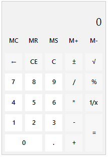
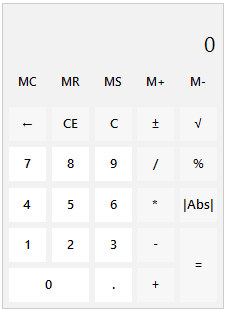

# Custom Functions

This article aims to show a sample approach how to create a custom function, |Abs|, for returning the absolute value of the current entry in the calculator. The `|Abs|` button will replace the `1/x` button:

|Default functions|Custom function|
|----|----|
|||
 
>note The exact implementation of the custom calculation is just a sample approach. It may be customized according to the specific custom requirements that need to be covered.

<snippet id='calculator-custom-functions-customfunction-cs' />
<snippet id='calculator-custom-functions-customfunction-vb' />

# See Also
	
* [Design Time]()	
* [Getting Started]()	

