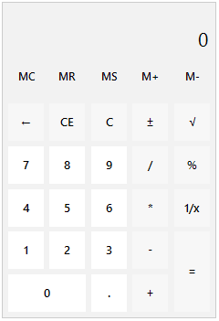

# Features

This article lists the main features supported by **RadCalculator**:

## Memory Functionality

RadCalculator supports all native memory functionality the end user is accustomed with:

* **Memory Plus (M+)** - adds the current input into the memory. For example:

	1\. Input - '3' -> M+ -> Memory Value - '3'

	2\. Input - '6' -> M+ -> Memory Value - '9'
* **Memory Minus (M-)** - substracts the current input value from the memory value. For example:

	1\. Input - '5' -> M- -> Memory Value - '-5'

	2\. Input - '6' -> M- -> Memory Value - '-11'
* **Memory Store (MS)** - stores the current input value into the memory. For example:

	1\. Input - '42' -> MS -> Memory Value - '42'

	2\. Input - '82' -> MS -> Memory Value - '82'
* **Memory Recall (MR)** - displays the value stored into the memory. For example:

	1\. Input - '42' -> MR -> Memory Value - '42'

	2\. MR -> Displayed Value - '42'
* **Memory Clear (MC)** - clears the memory value.

## Clear Functionality

RadCalculator supports all native clear functionality the end user is accustomed with.

* **Delete** - deletes the last digit from the displayed number.
* **Clear Entry (CE)** - clears the current input value:

	

* **Clear (C)** - clears the input value, the calculated value and the history:

	

## Keyboard Support
RadCalculator does allow you to use all relevant keys on your keyboard and insert any valid input or perform easily the operations.

The supported keys are as follows:

* **0 - 9** - all numeric keys both from the keyboard and the numeric pad.

* **Decimal key (.)** - allows insertion of decimal point from the numeric pad.

* **Add key (+)** - allows performing addition both from the keyboard and the numeric pad.

* **Substract key (-)** - allows performing substraction subtraction both from the keyboard and the numeric pad.

* **Multiply key (*)** - allows performing multiplication both from the keyboard and the numeric pad.

* **Divide key (/)** - allows performing division both from the keyboard and the numeric pad.

* **Enter key** - executes the operations.

* **F9 key** - performs negate operation.

* **R key (R)** - performs reciprocal operation.

* **Back key** - deletes a single digit from the input value.

* **Delete key (Del)** - deletes the input value.

* **Escape key (Esc)** - deletes the input value, the calculated value and the history. 

**RadCalculator** supports the following key combinations:

'**Shift +**' combinations:

* **2 Key (2)** - performs square root operation.

* **5 Key (5)** - performs percent operation.

'**Ctrl +**' combinations:

* **M Key (M)** - performs memory-store operation.

* **Y Key (Y)** - performs redo operation.

* **Z Key (Z)** - performs undo operation.

 
 

# See Also
	
* [Design Time]()	
* [Getting Started]()	

