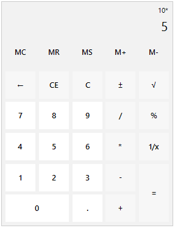

# RadCalculator

**RadCalculator** is a standalone control that performs all basic calculations such as addition, subtraction, multiplication, division as well as some more complicated ones – reciprocal, square root, negate. The operations can be executed either by clicking the calculator buttons, or by using your keyboard. You can also use the numeric keypad to type numbers and operators by pressing Num Lock. Furthermore, all the Memory and Clear features are exposed as well.





## Key Features

* Basic calculations: Addition, subtraction, multiplication, division.
* Additional calculations: Negate, square root, reciprocal.
* Keyboard support.
* Memory functionality.
* Clear entry, clear all, delete functionality.
* Customized functions.
 

# See Also

* [Structure]()	
* [Design Time]()	
* [Getting Started]()	

