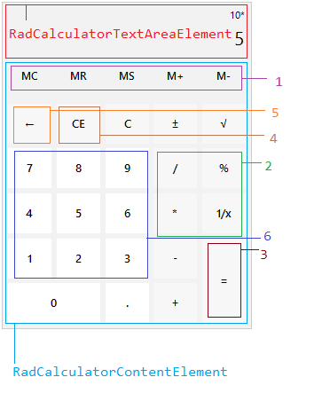
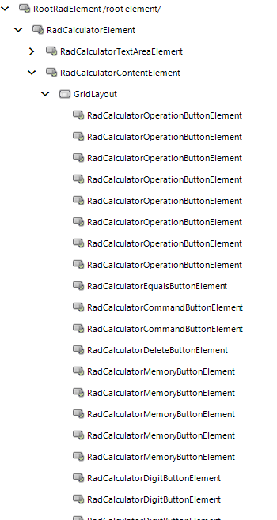

# Structure

This article describes the inner structure and organization of the elements which build **RadCalculator**.

* **RadCalculatorElement**
	* **RadCalculatorTextAreaElement** - represents the area at the top of the control that displays the calculated value.
	* **RadCalculatorContentElement** - represents a content element that contains all the calculator buttons.	
		* **GridLayout** - represents a container element that holds the buttons
		
			1\. **RadCalculatorMemoryButtonElement**

			2\. **RadCalculatorOperationButtonElement**

			3\. **RadCalculatorEqualsButtonElement**

			4\. **RadCalculatorCommandButtonElement**

			5\. **RadCalculatorDeleteButtonElement**
			
			6\. **RadCalculatorDigitButtonElement**

## Elements Hierarchy

 

# See Also
	
* [Design Time]()	
* [Getting Started]()	

